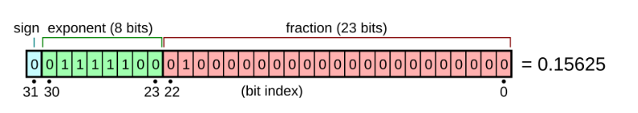

# CS336 Pytorch手把手搭建LLM - 讲座2笔记

## 概览:从理论到实践,从资源到代码

在上一讲中,我们探讨了从零开始构建语言模型的意义和动机,并介绍了分词(Tokenization)的概念. 本次讲座的核心目标是**动手搭建一个模型**,我们将深入PyTorch的核心组件,包括张量(Tensors)、模型(Models)、优化器(Optimizers)和训练循环(Training Loop).

本次课程的独特之处在于,我们将始终贯穿着**效率**的视角,特别是如何精确地核算我们所使用的计算资源——**内存(Memory)****和****算力(Compute)**.

### 核心思维:餐巾纸算术 (Napkin Math)

在构建大规模模型时,一个核心技能是在动手之前进行快速的“餐巾纸算术”,以估算资源消耗. 这不仅仅是学术训练,它直接关系到真金白银的成本.

例如,回答这样一个问题:“在1024张H100上,用15万亿(15T)个token训练一个700亿(70B)参数的稠密Transformer模型需要多长时间？”

其估算逻辑如下:

1. **计算总浮点运算次数 (FLOPS)**: 训练一个Transformer模型所需的总计算量,有一个广为接受的经验法则,即 `6 * 模型参数量 * 训练Token数`. 关于这个“6”是怎么来的,我们将在这节课中揭晓.
2. **计算硬件的总算力**:

   - 查询H100的理论峰值算力.
   - 乘以一个关键系数——**MFU (模型FLOPS利用率)**. 这是一个衡量你的代码实际利用硬件理论性能的效率指标,通常设为50%(0.5)就算不错的水平.
   - 再乘以GPU数量(1024)和每天的秒数.

3. **计算所需天数**: `总FLOPS / 每天可完成的FLOPS`. 通过这个简单的计算,我们可以得出大约需要144天.

这种估算能力,能让你在项目初期就对成本和周期有清晰的认知,是专业工程师的必备素养.

### Q: 使用AdamW,在H100上训练的最大模型是多大,如果不采取任何的优化手段

A:H100有100GB的HBM,参数,梯度和优化器的每个参数需要16Byte,参数量=总显存量/参数所需字节数

80*1024*1024/16≈40B.这个估算非常粗略,因为没考虑激活值,激活值取决于Batchsize和Sequence Length

> 这是绝大多数人都不习惯做的事情,大多数人就是训练一个模型,然后就看到结果了. 但记住,效率是关键

## 一、 内存核算 (Memory Accounting)

深度学习中的一切——参数、梯度、优化器状态、数据、激活值——都存储在一种叫做[张量 (Tensors)](./Lecture2-PyTorch-Tensors.md)的数据结构中. 因此,理解内存占用的第一步,就是理解一个张量占多少内存.

### 1.1 核心构建块:张量与浮点数

张量的内存占用由两个因素决定:元素的数量和每个元素的数据类型. 在深度学习中,最核心的数据类型是[浮点数 (Floating-Point Numbers)](./Lecture2-Floating-Point-Representations.md). 不同的浮点数格式在精度和内存占用上有所不同,直接影响模型的训练稳定性和效率.

```python
import torch
import torch.nn as nn
import math

# --- 1. 常规创建方法 ---

# 从 Python 列表直接创建
tensor_from_data = torch.tensor([[1., 2.], [3., 4.]])

# 创建指定形状的全0张量
zeros_tensor = torch.zeros(3, 4)

# 创建指定形状的、服从标准正态分布的随机张量
randn_tensor = torch.randn(3, 4)

# 创建一个未初始化的张量 
empty_tensor = torch.empty(3, 4)


# --- 2. 特殊初始化方法 (通常在 nn.Module 内部对参数使用) ---

# 准备一个线性层的权重张量用于演示
weight = torch.empty(128, 512)

# 方法一: Xavier (Glorot) 初始化 
# PyTorch 提供了两种实现: 
# a) 均匀分布版本
nn.init.xavier_uniform_(weight)
# b) 正态分布版本
nn.init.xavier_normal_(weight)

# 方法二: 截断正态分布 (Truncated Normal) 初始化 
# 从正态分布 N(0, 0.02^2) 中采样,但丢弃所有在 [-0.04, 0.04] 之外的值
nn.init.trunc_normal_(weight, std=0.02, a=-0.04, b=0.04)

# 方法三: 手动实现讲座中描述的方差缩放原则 
# 这有助于深刻理解其背后原理
input_features = 512
manual_scaled_weight = torch.randn(128, input_features) / math.sqrt(input_features)
```

例如,一个`torch.float32`类型的 `4x8` 矩阵,包含32个元素. 每个`float32`元素占用4个字节(32位),因此总内存为 `32 * 4 = 128` 字节. 对于真实的大模型,比如GPT-3中的一个FFN(前馈网络)权重矩阵,其尺寸可能达到 `2048 x 8192`,仅这一个矩阵就需要2.3GB的`float32`内存.

#### Float32 全精度数据格式

当然这个全精度的表达也得分人,如果你和搞科学计算的人交流他们会笑话你,因为他们会使用float64,甚至更高. 但是如果你和搞机器学习的人这么说,那他会表示: 我不能同意更多

> 是的,深度学习就是这么不拘小节(sloppy like that)



### 1.2 硬件上的内存:CPU与GPU

默认情况下,PyTorch的张量创建在CPU的内存中. 为了利用GPU进行高速并行计算,你必须显式地将数据从CPU内存转移到GPU的高带宽内存(HBM)中.

```python
# 数据从CPU转移到GPU
x_cpu = torch.randn(32, 32)
x_gpu = x_cpu.to('cuda')

# 直接在GPU上创建
y_gpu = torch.randn(32, 32, device='cuda')
```

这个数据转移过程本身是有开销的. 在编写代码时,必须时刻清楚你的每个张量“居住”在哪里,这是性能优化的关键.

## 二、 算力核算 (Compute Accounting)

### 2.1 基础运算与矩阵乘法 (MatMul)

张量运算构成了模型计算的核心. 虽然有各种逐元素操作(如`add`, `sin`),但深度学习中算力消耗的绝对大头是**矩阵乘法 (Matrix Multiplication, MatMul)**.

一个尺寸为 `(B, D)` 的矩阵与一个 `(D, K)` 的矩阵相乘,得到一个 `(B, K)` 的矩阵. 其所需的浮点运算次数 (FLOPS) 为:

`FLOPS = 2 * B * D * K`

这里的“2”代表了每次乘法和加法运算. 这个公式是进行算力估算的基础. 在语言模型中,操作通常是批处理的,例如一个张量的维度可能是 `(Batch, Sequence, Hidden)`,PyTorch能够优雅地处理这种批处理的矩阵乘法.

### 2.2 模型FLOPS利用率 (MFU)

我们如何衡量代码的计算效率？**MFU (Model FLOPs Utilization)** 是一个关键指标.

`MFU = 实际达到的FLOPS每秒 / 硬件理论峰值FLOPS每秒`

- **实际达到的FLOPS每秒** = `模型一次前向+反向传播的理论计算量 / 实际耗时`
- **硬件理论峰值FLOPS每秒** = 从NVIDIA等厂商的规格表中查到的理论值(注意数据类型,如BF16或FP8).

通常,MFU能达到50%以上就被认为是比较高效的. 如果MFU过低(如低于10%),说明你的模型或代码没有充分利用硬件的矩阵运算能力,可能存在数据加载瓶颈、或者大量小型运算等问题.

### 2.3 `einops`:更优雅的张量操作

在处理高维张量时,使用索引(如`-1`, `-2`)来进行维度转换(如`transpose`)和矩阵乘法,非常容易出错且难以阅读. `einops`(爱因斯坦求和约定操作)库提供了一种更直观、更不易出错的方案. 它通过为维度命名的字符串来描述张量操作.

例如,要将两个形状为 `(batch, sequence, hidden)` 的张量进行内积,传统方法可能是:

`result = torch.matmul(x, y.transpose(-2, -1))`

使用 `einops`,代码变得清晰可读:

```python
from einops import rearrange, reduce, einsum

# b代表batch, s1/s2代表sequence, h代表hidden
# 'h'在输出中消失,意味着它被求和了
result = einsum(x, y, 'b s1 h, b s2 h -> b s1 s2')
```

虽然不是必须,但熟练使用`einops`可以极大提升代码的可读性和健壮性.

## 三、 梯度、优化器与完整训练

### 3.1 梯度计算的成本:著名的“6N”法则

我们已经知道前向传播的计算成本,那么反向传播呢？通过链式法则的数学推导可以证明,对于一个典型的稠密线性层或Transformer层,**反向传播所需的计算量大约是前向传播的两倍**.

这就是**[梯度与反向传播的计算成本 (6N法则)](./Lecture2-Gradients-and-Backward-Pass.md)**的由来:

- **前向传播**: `2 * N * P` (其中N是token数,P是参数量)
- **反向传播**: `4 * N * P`
- **总计**: `6 * N * P`

这个 `6` 就是我们开头“餐巾纸算术”中使用的经验系数. 它解释了为什么训练一个模型的总计算量与参数量和数据量的乘积成正比.

### 3.2 参数初始化

模型参数的初始值至关重要. 如果使用朴素的正态分布初始化,随着网络层数加深,激活值的方差会急剧增大或减小,导致训练不稳定.

一个简单而有效的策略是**Xavier/He初始化**. 核心思想是,将随机初始化的权重除以其输入维度的平方根,从而使得每一层的输出方差保持在1左右,保证了信息的稳定流动.

```python
# 简单的缩放,是He初始化的核心思想
w = torch.randn(in_dim, out_dim) / math.sqrt(in_dim)
```

### 3.3 优化器与内存开销

[优化器 (Optimizers)](./Lecture2-Optimizers.md) 负责根据计算出的梯度来更新模型参数. 从经典的随机梯度下降(SGD)到目前最常用的Adam,优化器本身也需要存储额外的状态信息,这会带来显著的内存开销.

例如,Adam优化器需要为每个模型参数存储其一阶矩(动量)和二阶矩(梯度平方的移动平均值). 这意味着,如果你的模型参数是`FP32`,Adam会额外需要 `2 * 4 * P` 字节的GPU内存.

### 3.4 完整的资源占用分析

现在,我们可以对一个完整的训练步骤进行内存和计算的全面估算了.

**总内存占用 ≈ 参数内存 + 梯度内存 + 优化器状态内存 + 激活值内存**

- **参数**: `P` 个参数,通常用`FP32`存储. 内存:`4 * P`.
- **梯度**: 与参数一一对应. 内存:`4 * P`.
- **优化器状态 (以Adam为例)**: 需要2个状态/参数. 内存:`2 * 4 * P`.
- **激活值**: 每一层网络的输出,在反向传播时需要用于计算梯度. 其大小与 `批大小 * 序列长度 * 隐藏层维度 * 层数` 成正比. 这是一个动态变化的值,但对于大模型来说也相当可观.

将这些加起来,一个粗略的估算是,使用Adam优化器以`FP32`训练一个模型,仅参数、梯度和优化器状态就需要 `(4+4+8) * P = 16 * P` 字节的内存. 如果一个H100有80GB内存,不考虑激活值和其他开销,理论上最多可以容纳 `80e9 / 16 ≈ 50亿` 参数的模型.

### 3.5 训练循环、检查点与混合精度

- **训练循环 (Training Loop)**: 这是所有组件协同工作的地方:加载数据、执行前向传播计算损失、执行反向传播计算梯度、最后由优化器更新参数.
- **训练检查点 (Checkpointing)**: 由于大模型训练耗时漫长且可能中断,定期保存**模型权重**和**优化器状态**至关重要. 只保存模型权重是不够的,因为丢失了优化器状态(如Adam中的动量信息)会导致训练从一个次优的状态重新开始,影响收敛.
- **混合精度训练 (Mixed-Precision Training)**: 为了兼顾速度和稳定性,一种常见的做法是采用混合精度. 例如,使用 `BF16` 进行计算密集的前向和反向传播(速度快,内存省),但用更稳定的 `FP32` 来存储和更新模型的“主权重”以及优化器状态. PyTorch的`torch.autocast`等工具可以帮助自动管理这个过程.

## 总结

本次讲座从最基础的张量出发,系统地介绍了如何对模型训练的内存和计算资源进行量化分析. 我们不仅学习了PyTorch的具体操作,更建立了一种“资源会计”的思维模式. 掌握了这些“餐巾纸算术”的技巧,你将能更自信地驾驭和设计大规模语言模型. 在作业1中,你将亲手为Transformer模型应用今天学到的所有概念.