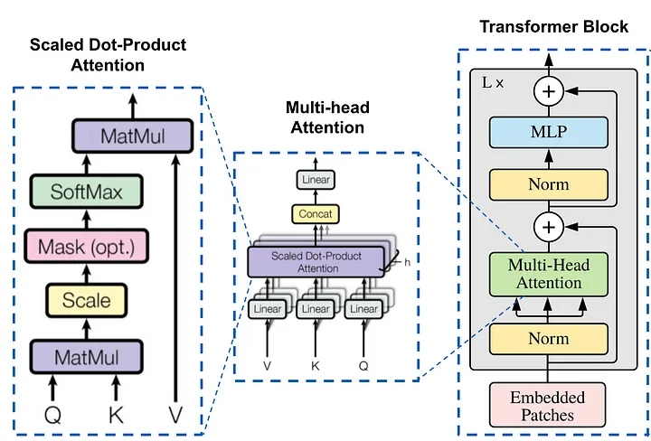
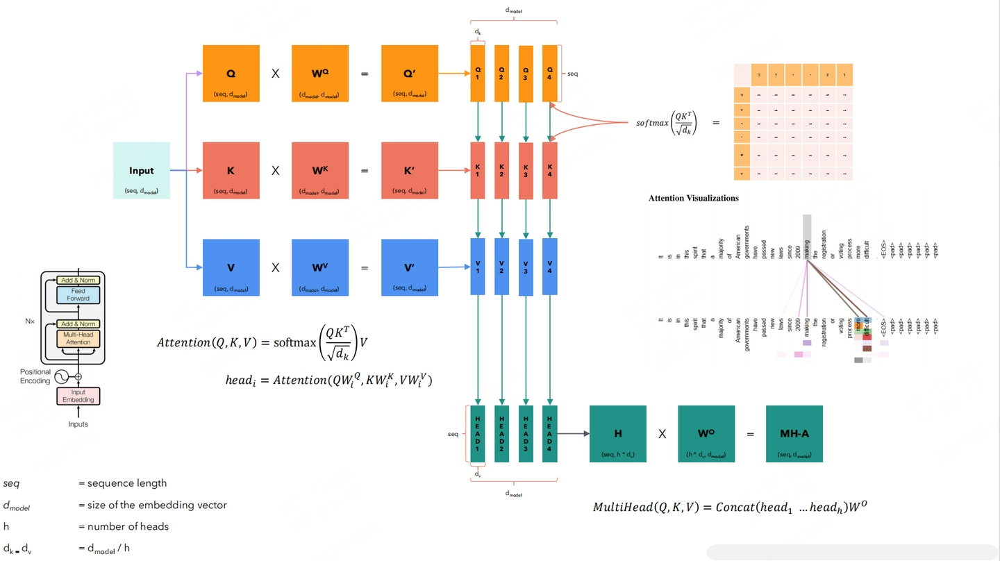
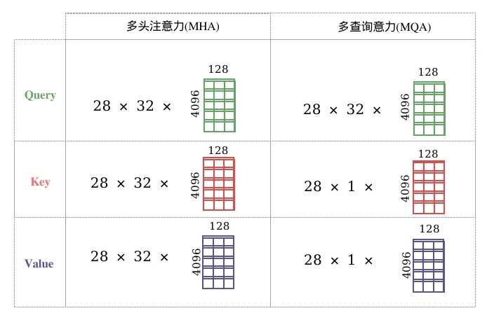
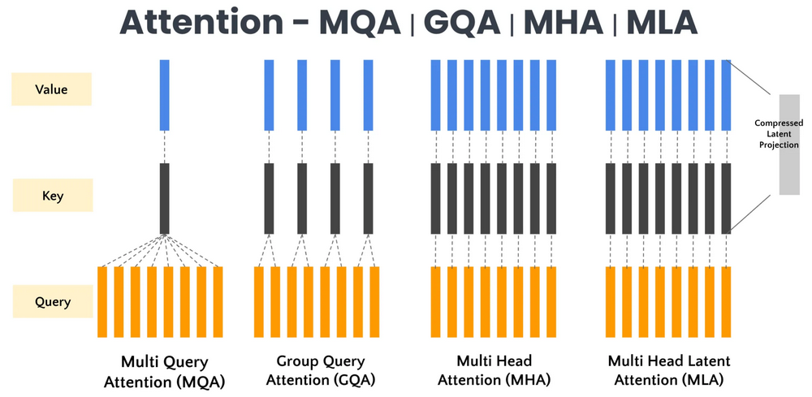
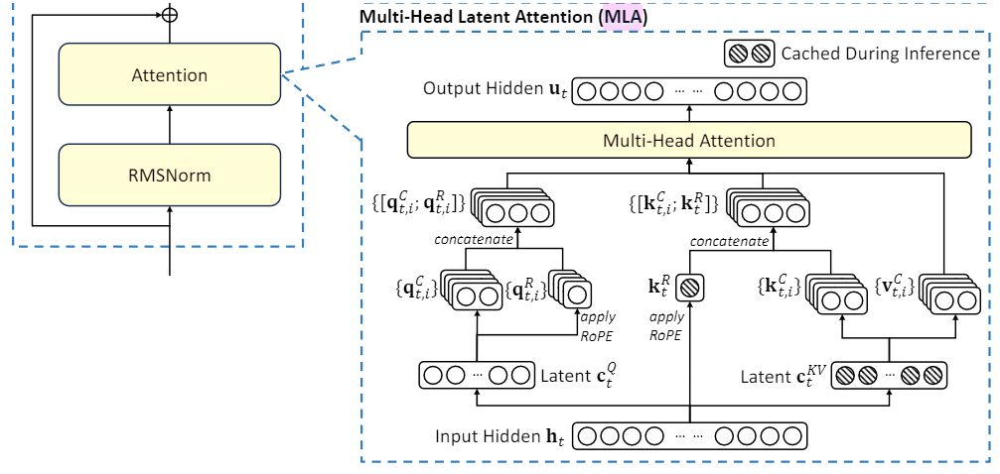

# **变量定义**

在深入探讨各种注意力机制之前,我们首先统一定义本文中将使用的变量. 明确的变量命名有助于我们精确地理解每个计算步骤的含义.

- **基础维度 (Basic Dimensions)**:

  - $B$: 批处理大小 (Batch Size), 表示一次处理的序列数量.
  - $S$: 序列长度 (Sequence Length), 表示每个序列中token的数量.
  - $d_{model}$: 模型的隐藏层维度 (Hidden Dimension), 即每个token的输入/输出嵌入向量的维度.
  - $N_q\_heads$: 查询头的数量 (Number of Query Heads).
  - $N_{kv}\_heads$: 键/值头的数量 (Number of Key/Value Heads).

    - 在**MHA**中,$N_{kv}\_heads = N_q\_heads$.
    - 在**MQA**中,$N_{kv}\_heads = 1$.
    - 在**GQA**中,$1 \le N_{kv}\_heads \le N_q\_heads$.

  - $N_{kv}\_groups$: 键/值组的数量 (Number of Key/Value Groups), 仅用于**GQA**,$N_{kv}\_groups = N_{kv}\_heads$.
  - $d_{head}$: 每个注意力头的维度 (Head Dimension). 通常 $d_{head} = d_{model} / N_q\_heads$.

- **张量与向量 (Tensors & Vectors)**:

  - $H \in \mathbb{R}^{B \times S \times d_{model}}$: 输入张量, 包含了批次中所有序列的token嵌入.
  - $h_t \in \mathbb{R}^{d_{model}}$: 在序列中位置为 $t$ 的token的输入隐藏状态 (嵌入向量).
  - $W_Q, W_K, W_V \in \mathbb{R}^{d_{model} \times d_{model}}$: **MHA**中用于将输入 $H$ 投影到Q, K, V空间的总投影矩阵.
  - $W_{Q,h}, W_{K,h}, W_{V,h} \in \mathbb{R}^{d_{model} \times d_{head}}$: **MHA**中每个注意力头 $h$ 独立的投影矩阵.
  - $W_O \in \mathbb{R}^{d_{model} \times d_{model}}$: 最终的输出投影矩阵, 用于将拼接后的多头输出映射回模型维度.

- **精细化QKV向量 (Granular QKV Vectors)**:

  - $q_{t,h} \in \mathbb{R}^{d_{head}}$: 对应于**位置t的token**,在**注意力头h**中计算出的**查询(Query)向量**.
  - $k_{j,h} \in \mathbb{R}^{d_{head}}$: 对应于**位置j的token**,在**注意力头h**中计算出的**键(Key)向量**.
  - $v_{j,h} \in \mathbb{R}^{d_{head}}$: 对应于**位置j的token**,在**注意力头h**中计算出的**值(Value)向量**.

- **注意力计算中间量 (Intermediate Attention Values)**:

  - $score_{t,j,h}$: 在**注意力头h**中,**位置t的token**对**位置j的token**的原始注意力分数(未归一化).
  - $\alpha_{t,j,h}$: 在**注意力头h**中,**位置t的token**对**位置j的token**的归一化后的注意力权重.
  - $o_{t,h} \in \mathbb{R}^{d_{head}}$: 在**注意力头h**中,为**位置t的token**计算出的上下文向量 (该头的输出).
  - $O_t \in \mathbb{R}^{d_{model}}$: 为**位置t的token**计算出的,将所有头的输出 $o_{t,h}$ 拼接后得到的向量.

- **MLA特定变量 (MLA-Specific Variables)**:

  - $d_c$: KV低秩压缩后的潜在维度.
  - $d_c'$: Q低秩压缩后的潜在维度.
  - $d_r$: 用于**RoPE**的解耦部分的维度.
  - $c_j^{KV} \in \mathbb{R}^{d_c}$: 对位置 $j$ 的token的KV部分进行降维后得到的共享**潜在(Latent)向量**.
  - $c_t^Q \in \mathbb{R}^{d_c'}$: 对位置 $t$ 的token的Q部分进行降维后得到的**潜在(Latent)向量**.
  - $W_{DKV} \in \mathbb{R}^{d_{model} \times d_c}$: **KV**下投影矩阵.
  - $W_{DQ} \in \mathbb{R}^{d_{model} \times d_c'}$: **Q**下投影矩阵.
  - $W_{UQ,h} \in \mathbb{R}^{d_c' \times (d_{head}-d_r)}$: **Q**内容部分上投影矩阵.
  - $W_{UK,h} \in \mathbb{R}^{d_c \times (d_{head}-d_r)}$: **K**内容部分上投影矩阵.
  - $W_{UV,h} \in \mathbb{R}^{d_c \times (d_{head}-d_r)}$: **V**内容部分上投影矩阵.
  - $W_{QR,h} \in \mathbb{R}^{d_c' \times d_r}$: **Q**的**RoPE**部分投影矩阵.
  - $W_{KR} \in \mathbb{R}^{d_{model} \times d_r}$: **K**的**RoPE**部分投影矩阵.
  - $q_{t,h}^C, k_{j,h}^C, v_{j,h}^C \in \mathbb{R}^{d_{head}-d_r}$: 分别从潜在向量 $c_t^Q$ 或 $c_j^{KV}$ 升维得到的**内容**(Content)部分的Q, K, V向量.
  - $q_{t,h}^R, k_j^R \in \mathbb{R}^{d_r}$: 用于承载RoPE的解耦部分的Q, K向量.

# **引言**

在深度学习,特别是自然语言处理(NLP)领域,注意力机制(Attention Mechanism)是一个非常重要的概念. 注意力机制的起源可以追溯到对生物视觉注意力的模拟以及神经机器翻译的实际需求. Bahdanau等人的工作首次将注意力机制引入自然语言处理领域；而Transformer架构则将注意力机制推向了一个新的高度,使其成为现代自然语言处理的核心技术之一.

Transformer架构的出现可以说是全球人工智能快速发展的转折点,该架构由Encoder和Decoder两部分组成,其中Encoder部分发展成了Bert、Roberta等模型,Decoder部分发展成了GPT等生成式大模型. 此类模型效果强悍,并得到了广泛的应用,这进一步推动了注意力机制的发展.

然而,随着模型规模的不断扩大和上下文长度的日益增长,传统的注意力机制在推理阶段面临着巨大的计算和内存挑战. 特别是,自回归生成任务中**Key-Value (KV) Cache**的指数级增长成为了瓶颈,极大地限制了大型语言模型(LLM)的吞吐量和可服务性. 为了解决这些挑战,研究者们不断探索和提出了各种注意力变体,旨在优化性能、降低成本,并提升LLM在实际应用中的效率.

本文将详细介绍注意力机制从**MHA (Multi-Head Attention)到MQA (Multi-Query Attention)**、**GQA (Grouped-Query Attention)**,再到**MLA (Multi-head Latent Attention)**的演变过程. 我们将深入探讨每个变体的设计理念、实现细节、数学公式推导,并着重分析它们如何影响KV Cache的存储效率,以及在性能和成本之间做出的权衡.

***

# 0. KV Cache

KV Cache实际上是一种专为生成式模型设计的优化技术,因此可以认为它只在模型的解码(decoder)部分发挥作用.

当我们要求模型根据一段上下文(包括之前的对话历史和当前的新问题)生成回答时,模型会逐个token地进行.对于生成第 $t+1$ 个token的过程,其自注意力计算如下:

1. **输入与投影**:模型将上一步生成的token $x_t$ 作为当前输入,并将其投影,生成当前步的查询、键和值向量:

   $Q_{t+1} = x_t W_Q$

   $K_{t+1} = x_t W_K$

   $V_{t+1} = x_t W_V$

2. **利用缓存**:此时,模型从缓存中取出之前所有 $t$ 个token的键值对:

   $K_{cache} = [K_1, K_2, ..., K_t]$

   $V_{cache} = [V_1, V_2, ..., V_t]$

3. **计算注意力**:模型使用当前步新生成的查询向量 $Q_{t+1}$,去和**所有**历史的键向量(缓存中的加上当前新生成的)进行计算,以决定注意力应该放在哪里.完整的键值向量集合为:

   $K_{all} = [K_{cache}, K_{t+1}]$

   $V_{all} = [V_{cache}, V_{t+1}]$

   注意力输出的计算公式为:

   $Output_{t+1} = \text{softmax}(\frac{Q_{t+1} \cdot K_{all}^T}{\sqrt{d_k}}) \cdot V_{all}$

4. **更新缓存**:计算完成后,当前步新生成的 $K_{t+1}$ 和 $V_{t+1}$ 会被追加到缓存中,为下一步生成token做好准备.

从这个过程中可以清楚地看到,在生成第 $t+1$ 个和第 $t+2$ 个token时,它们都会用到第1到第 $t$ 个token所产生的KV向量.这些历史KV向量是重复使用的.因此,把它们存储(cache)下来,就可以避免每次都从原始输入开始重复计算这部分内容,模型只需要专注于利用当前新token生成的查询向量 $Q_{t+1}$ 去进行计算即可.

**为什么只存储K和V,而不存储Q？**

- 由于Q是当前时间步的输入,每次生成新token时都会重新计算Q,不需要缓存.
- 而K和V可以复用之前时间步的计算结果,通过缓存K和V,可以避免在每个时间步重新计算它们,从而提升效率.

**KV Cache的占用内存会随着QA的进行线性增长**

KV Cache通常用于存储模型在处理序列数据时生成的键值对,以便在生成后续内容时能够快速访问之前的信息.

在实际实验时,每次问答(QA)记录都会增加KV Cache的存储需求,因为模型需要保留之前问答的上下文信息以生成连贯的响应.这种线性增长的内存占用可能会导致在处理长对话或大量问答时,内存需求显著增加,从而影响系统的性能和效率.

由于内存限制,LLM的回复能力确实会随着问答的进行逐渐变差,这种现象可以理解为模型具备一定的“**遗忘性**”.具体而言,由于硬件资源的限制,KV Cache的大小是有限的.当缓存达到其容量上限时,旧的信息可能会被新的信息覆盖或丢弃.其表现为随着问答的进行,早期的对话内容可能会因为KV Cache的容量限制而被移除或覆盖,导致模型逐渐“遗忘”之前的上下文.由于模型无法访问完整的对话历史,其生成的回复可能会变得不够准确或连贯,尤其是在需要依赖早期信息的情况下.所以,在长对话或多轮问答中,模型的性能可能会显著下降,因为它无法有效地利用整个对话历史.

**简而言之,KV Cache是一种用内存换取推理速度的技巧.**

# **1. MHA (Multi-Head Attention): 并行子空间的探索**

**MHA**是**Transformer**架构的基石. 它的核心思想是将单一的注意力计算分解为多个并行的、独立的"头" ($N_q\_heads$),每个头在输入的不同表示子空间中学习注意力权重,最后将所有头的输出聚合起来. 这使得模型能同时关注来自不同位置、不同方面的多种信息.

> 图 1: **MHA**计算过程示意图,Q, K, V被拆分为多个头并行计算.

## 1.1 出现原因与设计思路

- **出现原因: 单头注意力的局限性**

  - 传统的单头注意力(Single-Head Attention)虽然能捕捉到输入元素之间的关系,但它只能在一个单一的、固定的表示空间中进行. 这意味着模型在处理复杂、多模态或多义性的信息时,其能力可能会受限,难以同时关注到输入序列中不同层面(例如语法结构、语义关系、指代消解等)的细微特征.
  - 此外,在一个大维度空间进行一次性注意力计算,可能导致模型难以在训练中收敛到最优解,或对某些噪音敏感.

- **设计思路: 并行化与多视角学习**
- **并行子空间学习**: MHA通过引入多个“注意力头”,将输入的原始维度 $d_{model}$ 分割成 $N_q\_heads$ 个更小的子空间,每个子空间维度为 $d_{head} = d_{model} / N_q\_heads$. 每个头独立地在自己的子空间中执行注意力计算,学习不同的注意力模式.
- **丰富特征表示**: 这种设计允许模型从多个“视角”或“表示子空间”去理解输入信息. 例如,一个头可能关注长距离依赖,另一个头可能关注局部语义,从而捕获更丰富、更复杂的上下文信息.
- **提升鲁棒性与表现力**: 多头的集成输出,使得模型对单一头的计算偏差不那么敏感,提升了模型的鲁棒性. 同时,通过融合来自不同视角的注意力信息,显著增强了模型的表达能力和性能.

## 1.2 实现方法与详细数学公式推导

**MHA**的实现方法是典型的“分而治之”. 每个头都有自己独立的权重矩阵来投影Q、K、V,然后并行计算注意力,最后将结果合并.

1. **输入**: 批次中所有序列的token嵌入张量 $H \in \mathbb{R}^{B \times S \times d_{model}}$.  
   对于序列中位置 $t$ 的单个token的隐藏状态为 $h_t \in \mathbb{R}^{d_{model}}$.
2. **线性投影与多头拆分**:  
   首先,通过三个大型线性投影矩阵 $W_Q, W_K, W_V \in \mathbb{R}^{d_{model} \times d_{model}}$ 将输入 $H$ 投影到Q、K、V空间.

$Q_{proj} = H W_Q \in \mathbb{R}^{B \times S \times d_{model}}$

$K_{proj} = H W_K \in \mathbb{R}^{B \times S \times d_{model}}$

$V_{proj} = H W_V \in \mathbb{R}^{B \times S \times d_{model}}$

然后,将这些投影后的矩阵沿着 $d_{model}$ 维度切分成 $N_q\_heads$ 个头,并调整维度以便并行计算. 每个头的维度为 $d_{head} = d_{model} / N_q\_heads$.

$Q = Q_{proj}.\text{view}(B, S, N_q\_heads, d_{head}).\text{transpose}(1, 2) \in \mathbb{R}^{B \times N_q\_heads \times S \times d_{head}}$

$K = K_{proj}.\text{view}(B, S, N_q\_heads, d_{head}).\text{transpose}(1, 2) \in \mathbb{R}^{B \times N_q\_heads \times S \times d_{head}}$

$V = V_{proj}.\text{view}(B, S, N_q\_heads, d_{head}).\text{transpose}(1, 2) \in \mathbb{R}^{B \times N_q\_heads \times S \times d_{head}}$

此时,对于批次中第 $b$ 个样本,序列中位置 $t$ 的token,在第 $h$ 个注意力头中的查询向量为 $q_{t,h} \in \mathbb{R}^{d_{head}}$,同样有 $k_{j,h} \in \mathbb{R}^{d_{head}}$ 和 $v_{j,h} \in \mathbb{R}^{d_{head}}$.

3. **计算注意力分数 (Scaled Dot-Product Attention)**:  
   对于每个注意力头 $h$,计算查询 $q_{t,h}$ 与所有历史键 $k_{j,h}$ 的点积相似度. 由于自回归模型中的因果掩码(Causal Mask),位置 $t$ 的token只能关注它自身和它之前的tokens ($j \le t$).

$score_{t,j,h} = \frac{q_{t,h} \cdot k_{j,h}}{\sqrt{d_{head}}}$

在矩阵形式中,这表示为 $QK^T / \sqrt{d_{head}}$. 对于因果模型,需要应用一个下三角掩码,将 $j > t$ 的 $score_{t,j,h}$ 设为 $-\infty$.

$\text{Attention Scores} = \frac{Q K^T}{\sqrt{d_{head}}} \in \mathbb{R}^{B \times N_q\_heads \times S \times S}$

4. **Softmax归一化**:  
   对缩放后的注意力分数沿最后一个维度(键序列长度维度)应用Softmax函数,得到注意力权重. 这些权重表示每个token对历史序列中每个token的关注程度.

$\alpha_{t,j,h} = \text{Softmax}(score_{t,j,h}) = \frac{\exp(score_{t,j,h})}{\sum_{j'=1}^{t} \exp(score_{t,j',h})}$

在矩阵形式中:

$\text{Attention Weights} = \text{Softmax}(\text{Attention Scores}) \in \mathbb{R}^{B \times N_q\_heads \times S \times S}$

5. **计算单头输出 (加权求和)**:  
   使用注意力权重 $\alpha_{t,j,h}$ 对值向量 $v_{j,h}$ 进行加权求和,得到每个注意力头 $h$ 为位置 $t$ 的token计算出的上下文向量 $o_{t,h} \in \mathbb{R}^{d_{head}}$.

$o_{t,h} = \sum_{j=1}^{t} \alpha_{t,j,h} \cdot v_{j,h}$

在矩阵形式中:

$\text{Attention Output (per head)} = \text{Attention Weights} \cdot V \in \mathbb{R}^{B \times N_q\_heads \times S \times d_{head}}$

6. **合并与最终投影**:  
   将所有注意力头 $h$ 的输出向量 $o_{t,h}$ 沿着 $N_q\_heads$ 和 $d_{head}$ 维度拼接起来,还原为 $d_{model}$ 维度的表示.

$O_t = \text{Concat}(o_{t,1}, o_{t,2}, \dots, o_{t,N_q\_heads}) \in \mathbb{R}^{d_{model}}$

在矩阵形式中:

$\text{Combined Output} = \text{Attention Output (per head)}.\text{transpose}(1, 2).\text{contiguous}().\text{view}(B, S, d_{model}) \in \mathbb{R}^{B \times S \times d_{model}}$

最后,通过一个线性输出投影矩阵 $W_O \in \mathbb{R}^{d_{model} \times d_{model}}$ 将合并后的向量映射到最终的输出空间.

$\text{Final Output} = \text{Combined Output} \cdot W_O \in \mathbb{R}^{B \times S \times d_{model}}$

## 1.3 KV Cache: 概念、变化与牺牲

**KV Cache**是自回归生成过程中为了提高效率而引入的关键优化.

- **概念与作用**:  
  在LLM的自回归生成阶段,模型每次生成一个token,然后将这个新生成的token附加到之前的序列中,形成新的输入. 这意味着在生成后续token时,模型会重复计算前序token的Key和Value向量. KV Cache的作用就是将这些已经计算过的Key和Value向量存储起来,在后续步骤中直接复用,避免重复计算,从而**节省了大量的计算时间**. 这是一种典型的“**以空间换时间**”的优化策略.
- **如何实现KV Cache**:  
  在每次前向传播时,当前时间步计算出的Key和Value向量会被追加到缓存中. 在下一个时间步,新的Query向量会与缓存中的所有历史Key向量计算注意力分数,然后与缓存中的所有Value向量进行加权求和.  
  在MHA中,每个注意力头 $h$ 都有自己独立的 $K_h$ 和 $V_h$ 缓存.
- **KV Cache显存的变化与计算**:  
  对于一个拥有 $L$ 个Transformer层,批处理大小为 $B$,当前序列长度为 $S$,每个注意力头维度为 $d_{head}$ 的模型:  
  每个注意力头需要存储 $S \times d_{head}$ 的Key向量和 $S \times d_{head}$ 的Value向量.  
  由于有 $N_q\_heads$ 个注意力头,并且Key和Value各一份,总的KV Cache大小为:

$\text{KV Cache Size (MHA)} = L \times B \times S \times N_q\_heads \times 2 \times d_{head} \times \text{sizeof(float)}$

考虑到 $N_q\_heads \times d_{head} = d_{model}$,该公式也可以写为:

$\text{KV Cache Size (MHA)} = L \times B \times S \times 2 \times d_{model} \times \text{sizeof(float)}$

**为什么能节省显存？**  
KV Cache本身会占用显存,但它节省的是**计算时间**. 通过避免重复计算历史Key和Value的投影和中间激活值,从而显著加速了推理过程,特别是对于长序列.  
**牺牲了什么？**  
KV Cache的引入,最大的牺牲就是**显存(内存)占用**. 对于Llama3 70B模型(L=80, $N_q\_heads=64$,$d_{head}=128$,16位精度),当批处理大小 $B=8$ 且序列长度 $S=1000$ 时:

$\text{KV Cache Size} = 80 \text{层} \times 8 \text{批次} \times 1000 \text{token} \times 64 \text{头} \times 2 \text{份} \times 128 \text{维} \times 2 \text{字节/份} \approx 20.97 \text{ GB}$

随着序列长度 $S$ 的增加,KV Cache的大小呈线性增长. 在处理非常长的上下文时,这很快就会成为限制模型性能和可部署性的瓶颈.

## 1.4 MHA计算例子

假设我们有一个非常简化的MHA模型,其参数如下:

- $B = 1$ (批次大小)
- $S = 3$ (序列长度,当前处理到第3个token)
- $d_{model} = 8$ (模型隐藏维度)
- $N_q\_heads = 2$ (查询头数量)
- $d_{head} = d_{model} / N_q\_heads = 8 / 2 = 4$ (每个头的维度)

我们来看在处理序列的第3个token时,单层MHA的KV Cache如何被利用.

1. **输入**$h_3$: 假设 $h_3 \in \mathbb{R}^8$ 是第3个token的输入向量.

- 为了简化,我们假设 $h_3 = [0.1, 0.2, 0.3, 0.4, 0.5, 0.6, 0.7, 0.8]$.

2. **投影与多头拆分**(仅当前 $h_3$):  
   $h_3$ 经过 $W_Q, W_K, W_V$ 投影,得到 $Q_{proj}(h_3), K_{proj}(h_3), V_{proj}(h_3)$,均为 $\mathbb{R}^8$ 向量.  
   然后拆分为每个头的 $d_{head}=4$ 维向量:

   - $q_{3,1} \in \mathbb{R}^4$ (第3个token,头1的Q向量)
   - $q_{3,2} \in \mathbb{R}^4$ (第3个token,头2的Q向量)
   - $k_{3,1} \in \mathbb{R}^4$ (第3个token,头1的K向量)
   - $k_{3,2} \in \mathbb{R}^4$ (第3个token,头2的K向量)
   - $v_{3,1} \in \mathbb{R}^4$ (第3个token,头1的V向量)
   - $v_{3,2} \in \mathbb{R}^4$ (第3个token,头2的V向量)

- **KV Cache更新**: $k_{3,1}, k_{3,2}, v_{3,1}, v_{3,2}$ 会被追加到KV Cache中.

3. **KV Cache的利用**:  
   假设在处理第3个token之前,KV Cache中已经存储了前2个token的Key和Value:

- **Key Cache** ($\mathbb{R}^{B \times N_q\_heads \times S_{past} \times d_{head}}$):  
  $K_{cache\_past} = [k_{1,1}, k_{2,1} \text{ (头1)}; k_{1,2}, k_{2,2} \text{ (头2)}] \in \mathbb{R}^{1 \times 2 \times 2 \times 4}$
- **Value Cache** ($\mathbb{R}^{B \times N_q\_heads \times S_{past} \times d_{head}}$):  
  $V_{cache\_past} = [v_{1,1}, v_{2,1} \text{ (头1)}; v_{1,2}, v_{2,2} \text{ (头2)}] \in \mathbb{R}^{1 \times 2 \times 2 \times 4}$

现在,将当前计算的 $k_{3,1}, k_{3,2}, v_{3,1}, v_{3,2}$ 追加到缓存中:

- $K_{cache\_current} = [k_{1,1}, k_{2,1}, k_{3,1} \text{ (头1)}; k_{1,2}, k_{2,2}, k_{3,2} \text{ (头2)}] \in \mathbb{R}^{1 \times 2 \times 3 \times 4}$
- $V_{cache\_current} = [v_{1,1}, v_{2,1}, v_{3,1} \text{ (头1)}; v_{1,2}, v_{2,2}, v_{3,2} \text{ (头2)}] \in \mathbb{R}^{1 \times 2 \times 3 \times 4}$

KV Cache的总大小(以16位浮点数为例):

- 每层: $2 \times \text{头数} \times \text{序列长度} \times \text{头维度} \times \text{字节数}$
- $2 \times 2 \times 3 \times 4 \times 2 \text{ bytes} = 96 \text{ bytes}$.
- 随着序列长度增加,这个值线性增长.

4. **计算注意力分数**(针对 $q_{3,h}$ 和 $K_{cache\_current}$):  
   以头1为例,计算 $q_{3,1}$ 与 $k_{1,1}, k_{2,1}, k_{3,1}$ 的分数:

   - $score_{3,1,1} = (q_{3,1} \cdot k_{1,1}) / \sqrt{4}$
   - $score_{3,2,1} = (q_{3,1} \cdot k_{2,1}) / \sqrt{4}$
   - $score_{3,3,1} = (q_{3,1} \cdot k_{3,1}) / \sqrt{4}$

- **因果掩码**: 如果是因果注意力,由于是当前token,没有未来的token,所以这里不会有掩码效应(或者说,只掩码未来的部分).

5. **Softmax**:

   - $\alpha_{3,j,1} = \text{Softmax}([score_{3,1,1}, score_{3,2,1}, score_{3,3,1}])$

6. **计算单头输出**:

   - $o_{3,1} = \alpha_{3,1,1} v_{1,1} + \alpha_{3,2,1} v_{2,1} + \alpha_{3,3,1} v_{3,1}$
   - 同样计算 $o_{3,2}$.

7. **合并与最终投影**:

   - $O_3 = \text{Concat}(o_{3,1}, o_{3,2})$
   - 最终输出 $o_3 = O_3 W_O$.

这个例子展示了KV Cache如何通过复用历史K、V来计算当前token的注意力,而不是重新计算整个序列的K、V.

***

# **2. MQA (Multi-Query Attention): 极致的KV共享**

面对**MHA**带来的巨大**KV Cache**压力,**MQA**提出了一种简单而有效的解决方案: 让所有查询头共享**同一份**Key和Value.

> 图 2: **MHA**(左)有多个独立的K/V头,而**MQA**(右)只有一个K/V头被所有Q头共享.

## 2.1 出现原因与设计思路

- **出现原因: MHA高昂的KV Cache成本**

  - MHA虽然能捕捉丰富信息,但其KV Cache的大小与 $N_q\_heads$ 成正比,对于Llama3 70B等大型模型来说,这很快就会成为限制推理速度和上下文长度的瓶颈.
  - 研究者意识到,尽管有多个注意力头,但许多Key和Value投影可能存在冗余,或者说并非所有头都需要独立的K、V信息.

- **设计思路: 最大化KV共享,降低显存**
- **共享K、V矩阵**: MQA的核心是极端简化K、V的结构. 它将 $N_{kv}\_heads$ 降至1,即所有 $N_q\_heads$ 个查询头(Q头)共享同一组Key和Value矩阵. 这意味着模型只需要计算和存储一套Key和Value.
- **牺牲与权衡**: 这种设计显著减少了KV Cache的内存占用和计算K、V的开销. 然而,它也牺牲了部分模型表达能力,因为不同的查询头无法再从独立的K、V信息源中提取特征,这可能导致在某些复杂任务上性能略有下降. 但对于推理速度的提升而言,这种牺牲通常被认为是值得的.

## 2.2 实现方法与详细数学公式推导

MQA的实现方法是对**MHA**的K和V投影层进行修改,使其只生成一份共享的K和V.

1. **输入**: 批次中所有序列的token嵌入张量 $H \in \mathbb{R}^{B \times S \times d_{model}}$.  
   对于序列中位置 $t$ 的单个token的隐藏状态为 $h_t \in \mathbb{R}^{d_{model}}$.
2. **线性投影与多头拆分**:

- **Query**的投影与**MHA**类似,生成 $N_q\_heads$ 个独立的Q头:

$Q_{proj} = H W_Q \in \mathbb{R}^{B \times S \times d_{model}}$

$Q = Q_{proj}.\text{view}(B, S, N_q\_heads, d_{head}).\text{transpose}(1, 2) \in \mathbb{R}^{B \times N_q\_heads \times S \times d_{head}}$

此时,对于批次中第 $b$ 个样本,序列中位置 $t$ 的token,在第 $h$ 个注意力头中的查询向量为 $q_{t,h} \in \mathbb{R}^{d_{head}}$.

- **Key和Value**的投影是共享的,只生成一份K和V(即 $N_{kv}\_heads = 1$),其维度为 $d_{head}$:

$K_{proj} = H W_K \in \mathbb{R}^{B \times S \times d_{head}}$

$V_{proj} = H W_V \in \mathbb{R}^{B \times S \times d_{head}}$

在计算时,这些共享的K和V会被广播到所有 $N_q\_heads$ 个查询头. 在处理序列中位置 $j$ 的token时,其共享键向量为 $k_j \in \mathbb{R}^{d_{head}}$,共享值向量为 $v_j \in \mathbb{R}^{d_{head}}$.

3. **计算注意力分数**:  
   对于每个查询头 $h$,它都与**同一个**共享的键序列 $K_{proj}$ 进行点积计算.

$score_{t,j,h} = \frac{q_{t,h} \cdot k_j}{\sqrt{d_{head}}}$

在矩阵形式中,通过适当的维度扩展(广播)实现:

$\text{Attention Scores} = \frac{Q \cdot K_{proj}^T.\text{unsqueeze}(1)}{\sqrt{d_{head}}} \in \mathbb{R}^{B \times N_q\_heads \times S \times S}$

(这里 $K_{proj}$ 需要在头维度上扩展 $N_q\_heads$ 次,以便与 $Q$ 对齐)

4. **Softmax归一化**:  
   对缩放后的注意力分数沿最后一个维度应用Softmax函数,得到注意力权重.

$\alpha_{t,j,h} = \text{Softmax}(score_{t,j,h})$

5. **计算单头输出 (加权求和)**:  
   每个头使用各自的注意力权重 $\alpha_{t,j,h}$,对**同一个**共享的值序列 $V_{proj}$ 进行加权求和.

$o_{t,h} = \sum_{j=1}^{t} \alpha_{t,j,h} \cdot v_j$

在矩阵形式中:

$\text{Attention Output (per head)} = \text{Attention Weights} \cdot V_{proj}.\text{unsqueeze}(1) \in \mathbb{R}^{B \times N_q\_heads \times S \times d_{head}}$

6. **合并与最终投影**:  
   将所有头的输出 $o_{t,h}$ 拼接起来,并最终通过输出投影矩阵 $W_O$ 得到结果.

$O_t = \text{Concat}(o_{t,1}, o_{t,2}, \dots, o_{t,N_q\_heads}) W_O$

$\text{Attention}(Q, K, V) = \text{Concat}(\text{head}_1, \dots, \text{head}_{N_q\_heads}) W_O$

$\text{where head}_h = \text{Softmax}\left(\frac{Q_h K^T}{\sqrt{d_{head}}}\right) V$

***

## 2.3 KV Cache: 变化与牺牲

- **KV Cache显存的变化**:  
  MQA最大的优点就是极大地减小了KV Cache的体积.  
  由于所有查询头共享一套Key和Value,KV Cache的大小只取决于1个Key头和1个Value头:

$\text{KV Cache Size (MQA)} = L \times B \times S \times 1 \times 2 \times d_{head} \times \text{sizeof(float)}$

相较于MHA,$N_q\_heads$ 的因子被消除了,KV Cache的大小直接减少到MHA的 $1/N_q\_heads$.  
以Llama3 70B模型为例,当 $N_q\_heads=64$ 时,KV Cache将减少64倍,从约20.97 GB降至约327.6 MB. 这是一个非常显著的内存节省.

- **牺牲了什么？**  
  MQA的牺牲主要是**模型性能**. 由于所有注意力头共享相同的K和V信息,它们无法像MHA那样从多样化的K、V子空间中学习. 这可能导致:
- **表达能力下降**: 模型可能无法捕捉到输入序列中所有细微的、多方面的关系.
- **收敛速度变慢或性能上限降低**: 在训练过程中,模型可能需要更长的时间才能收敛,或者最终达到的性能不如MHA.
- **训练稳定性**: 极端共享可能带来训练上的挑战.

## 2.4 MQA计算例子

假设我们延续MHA的例子,并将其改造为MQA模型:

- $B = 1$ (批次大小)
- $S = 3$ (序列长度,当前处理到第3个token)
- $d_{model} = 8$ (模型隐藏维度)
- $N_q\_heads = 2$ (查询头数量)
- $d_{head} = d_{model} / N_q\_heads = 8 / 2 = 4$ (每个头的维度)

1. **输入**$h_3$: 假设 $h_3 \in \mathbb{R}^8$.
2. **投影与多头拆分**(仅当前$h_3$):

   - $h_3$ 经过 $W_Q$ 投影,得到 $Q_{proj}(h_3) \in \mathbb{R}^8$,拆分为 $q_{3,1}, q_{3,2}$ (每个 $\mathbb{R}^4$).
   - $h_3$ 经过 $W_K$ 投影,得到**共享**的 $k_3 \in \mathbb{R}^4$.
   - $h_3$ 经过 $W_V$ 投影,得到**共享**的 $v_3 \in \mathbb{R}^4$.

- **KV Cache更新**: $k_3, v_3$ 会被追加到KV Cache中.

3. **KV Cache的利用**:  
   假设在处理第3个token之前,KV Cache中已经存储了前2个token的共享Key和Value:

- **Key Cache** ($\mathbb{R}^{B \times 1 \times S_{past} \times d_{head}}$):  
  $K_{cache\_past} = [k_1, k_2] \in \mathbb{R}^{1 \times 1 \times 2 \times 4}$ (一个Key头)
- **Value Cache** ($\mathbb{R}^{B \times 1 \times S_{past} \times d_{head}}$):  
  $V_{cache\_past} = [v_1, v_2] \in \mathbb{R}^{1 \times 1 \times 2 \times 4}$ (一个Value头)

现在,将当前计算的 $k_3, v_3$ 追加到缓存中:

- $K_{cache\_current} = [k_1, k_2, k_3] \in \mathbb{R}^{1 \times 1 \times 3 \times 4}$
- $V_{cache\_current} = [v_1, v_2, v_3] \in \mathbb{R}^{1 \times 1 \times 3 \times 4}$

KV Cache的总大小(以16位浮点数为例):

- 每层: $2 \times 1 \times 3 \times 4 \times 2 \text{ bytes} = 48 \text{ bytes}$.
- 相较于MHA的96 bytes,直接减少了一半,因为头数从2降到了1.

4. **计算注意力分数**(针对 $q_{3,h}$ 和 $K_{cache\_current}$):

   - $K_{cache\_current}$ 会被广播(复制)$N_q\_heads=2$ 次,形成 $\mathbb{R}^{1 \times 2 \times 3 \times 4}$.
   - 以头1为例,计算 $q_{3,1}$ 与 $k_1, k_2, k_3$ 的分数:

     - $score_{3,1,1} = (q_{3,1} \cdot k_1) / \sqrt{4}$
     - $score_{3,2,1} = (q_{3,1} \cdot k_2) / \sqrt{4}$
     - $score_{3,3,1} = (q_{3,1} \cdot k_3) / \sqrt{4}$

   - 同样,头2的 $q_{3,2}$ 会与相同的 $k_1, k_2, k_3$ 计算分数.

5. **Softmax**:

   - $\alpha_{3,j,1} = \text{Softmax}([score_{3,1,1}, score_{3,2,1}, score_{3,3,1}])$

6. **计算单头输出**:

   - $o_{3,1} = \alpha_{3,1,1} v_1 + \alpha_{3,2,1} v_2 + \alpha_{3,3,1} v_3$
   - $o_{3,2}$ 也会与相同的 $v_1, v_2, v_3$ 进行加权求和.

7. **合并与最终投影**:

   - $O_3 = \text{Concat}(o_{3,1}, o_{3,2})$
   - 最终输出 $o_3 = O_3 W_O$.

这个例子清晰展示了MQA如何通过共享K、V来显著减少KV Cache的存储量,即使这意味着每个查询头都使用相同的K、V信息.

***

# **3. GQA (Grouped-Query Attention): 平衡之道**

**GQA**是**MHA**和**MQA**之间的一种折中方案. 它认识到**MHA**的KV头可能存在冗余,而**MQA**的单一KV头又可能限制了模型性能. 因此,**GQA**将查询头分组,每组共享一对K/V头.

> 图 3: 从左到右: **MHA** (每个Q头有独立的KV头), **GQA** (一组Q头共享一个KV头), **MQA** (所有Q头共享一个KV头).

## 3.1 出现原因与设计思路

- **出现原因: MQA的性能损失与MHA的内存瓶颈**

  - MHA在性能上表现优秀,但KV Cache过大,不适合长序列推理.
  - MQA显著减少了KV Cache,但性能可能有所下降,尤其是对于需要复杂注意力模式的任务.
  - 研究者们需要找到一个中间点,既能保持接近MHA的性能,又能有效减少KV Cache.

- **设计思路: 分组共享,灵活权衡**
- **分组机制**: GQA的核心思想是将 $N_q\_heads$ 个查询头平均分配到 $N_{kv}\_heads$ 个组中,每组包含 $N_q\_heads / N_{kv}\_heads$ 个查询头. 每个组共享一套独立的Key和Value矩阵.
- **可伸缩性**: 通过调整 $N_{kv}\_heads$ (组的数量),GQA可以灵活地在MHA($N_{kv}\_heads = N_q\_heads$)和MQA($N_{kv}\_heads = 1$)之间进行权衡. 这使得模型设计者可以根据具体的应用场景和资源限制来选择最优的KV Cache压缩率和性能平衡点.
- **性能提升**: 相比MQA,GQA为不同组的查询头提供了不同的K、V信息,这增加了信息的多样性,从而弥补了MQA在表达能力上的不足,使其性能更接近MHA.

## 3.2 实现方法与详细数学公式推导

GQA的实现介于MHA和MQA之间. Q的投影方式与MHA类似,K和V的投影则根据组的数量进行,并且需要一个额外的步骤来重复KV头以匹配Q头的数量.

1. **输入**: 批次中所有序列的token嵌入张量 $H \in \mathbb{R}^{B \times S \times d_{model}}$.  
   对于序列中位置 $t$ 的单个token的隐藏状态为 $h_t \in \mathbb{R}^{d_{model}}$.
2. **线性投影与多头/组拆分**:

- **Query**的投影与**MHA**相同,生成 $N_q\_heads$ 个独立的Q头:

$Q_{proj} = H W_Q \in \mathbb{R}^{B \times S \times d_{model}}$

$Q = Q_{proj}.\text{view}(B, S, N_q\_heads, d_{head}).\text{transpose}(1, 2) \in \mathbb{R}^{B \times N_q\_heads \times S \times d_{head}}$

此时,对于批次中第 $b$ 个样本,序列中位置 $t$ 的token,在第 $h$ 个注意力头中的查询向量为 $q_{t,h} \in \mathbb{R}^{d_{head}}$.

- **Key和Value**的投影是根据组的数量 $N_{kv}\_heads$ 进行的,生成 $N_{kv}\_heads$ 份独立的K和V,每份的维度为 $d_{head}$.

$K_{proj} = H W_K \in \mathbb{R}^{B \times S \times (N_{kv}\_heads \times d_{head})}$

$V_{proj} = H W_V \in \mathbb{R}^{B \times S \times (N_{kv}\_heads \times d_{head})}$

然后将它们拆分成组维度:

$K = K_{proj}.\text{view}(B, S, N_{kv}\_heads, d_{head}).\text{transpose}(1, 2) \in \mathbb{R}^{B \times N_{kv}\_heads \times S \times d_{head}}$

$V = V_{proj}.\text{view}(B, S, N_{kv}\_heads, d_{head}).\text{transpose}(1, 2) \in \mathbb{R}^{B \times N_{kv}\_heads \times S \times d_{head}}$

此时,对于批次中第 $b$ 个样本,序列中位置 $j$ 的token,在第 $g$ 个KV组中的键向量为 $k_{j,g} \in \mathbb{R}^{d_{head}}$,值向量为 $v_{j,g} \in \mathbb{R}^{d_{head}}$.

3. **重复KV头以匹配Q头**:  
   在计算注意力分数之前,需要将KV组重复,使得每个查询头都能找到其对应的K和V. 每个KV组会被重复 $N_q\_heads / N_{kv}\_heads$ 次.

$K_{expanded} = K.\text{repeat\_interleave}(N_q\_heads / N_{kv}\_heads, \text{dim}=1) \in \mathbb{R}^{B \times N_q\_heads \times S \times d_{head}}$

$V_{expanded} = V.\text{repeat\_interleave}(N_q\_heads / N_{kv}\_heads, \text{dim}=1) \in \mathbb{R}^{B \times N_q\_heads \times S \times d_{head}}$

此时,虽然 $K_{expanded}$ 和 $V_{expanded}$ 的形状与MHA的K和V相同,但其内部数据是分组共享的.

4. **计算注意力分数**:  
   每个查询头 $q_{t,h}$ 与其所属组的共享键序列 $K_{expanded}$ 进行点积计算.

$score_{t,j,h} = \frac{q_{t,h} \cdot K_{expanded}[b, h, j, :]}{\sqrt{d_{head}}}$

在矩阵形式中:

$\text{Attention Scores} = \frac{Q K_{expanded}^T}{\sqrt{d_{head}}} \in \mathbb{R}^{B \times N_q\_heads \times S \times S}$

5. **Softmax归一化**:  
   对缩放后的注意力分数沿最后一个维度应用Softmax函数.

$\alpha_{t,j,h} = \text{Softmax}(score_{t,j,h})$

6. **计算单头输出 (加权求和)**:  
   每个头使用各自的注意力权重 $\alpha_{t,j,h}$,对其所属组的共享值序列 $V_{expanded}$ 进行加权求和.

$o_{t,h} = \sum_{j=1}^{t} \alpha_{t,j,h} \cdot V_{expanded}[b, h, j, :]$

在矩阵形式中:

$\text{Attention Output (per head)} = \text{Attention Weights} \cdot V_{expanded} \in \mathbb{R}^{B \times N_q\_heads \times S \times d_{head}}$

7. **合并与最终投影**:  
   将所有头的输出 $o_{t,h}$ 拼接起来,并最终通过输出投影矩阵 $W_O$ 得到结果.

$O_t = \text{Concat}(o_{t,1}, o_{t,2}, \dots, o_{t,N_q\_heads}) W_O$

$\text{Attention}(Q, K, V) = \text{Concat}(\text{head}_1, \dots, \text{head}_{N_q\_heads}) W_O$

$\text{where head}_h = \text{Softmax}\left(\frac{Q_h K_{\text{group}(h)}^T}{\sqrt{d_{head}}}\right) V_{\text{group}(h)}$

## 3.3 KV Cache: 变化与牺牲

- **KV Cache显存的变化**:  
  GQA在KV Cache大小上实现了MHA和MQA之间的灵活折中.  
  由于KV Cache只存储 $N_{kv}\_heads$ 份Key和Value:

$\text{KV Cache Size (GQA)} = L \times B \times S \times N_{kv}\_heads \times 2 \times d_{head} \times \text{sizeof(float)}$

相较于MHA,KV Cache的大小减少了 $N_q\_heads / N_{kv}\_heads$ 倍.  
以Llama3 70B模型($N_q\_heads=64$,$d_{head}=128$)为例,如果选择 $N_{kv}\_heads=8$ (Llama2/3 70B实际设置),KV Cache将减少 $64/8=8$ 倍.

$\text{KV Cache Size (GQA, } N_{kv}\_heads=8\text{)} = \frac{20.97 \text{ GB}}{8} \approx 2.62 \text{ GB}$

这比MHA显著降低,同时比MQA的极致压缩能更好地保持性能.

- **牺牲了什么？**  
  GQA的牺牲是**设计复杂性**和**最佳组数选择**.

虽然它在性能和效率之间取得了很好的平衡,但:

- **性能仍可能略低于MHA**: 虽然显著优于MQA,但完全独立的K、V(MHA)可能仍然拥有理论上的最大表达能力.
- **超参数调优**: 选择合适的 $N_{kv}\_heads$ 是一个需要经验和实验的超参数,过少会接近MQA的性能损失,过多则会增加KV Cache.
- **实现复杂性**: 引入分组机制比MQA更复杂,需要额外的维度操作和重复逻辑.

## 3.4 GQA计算例子

延续MQA的例子,将其改造为GQA模型:

- $B = 1$ (批次大小)
- $S = 3$ (序列长度,当前处理到第3个token)
- $d_{model} = 8$ (模型隐藏维度)
- $N_q\_heads = 2$ (查询头数量)
- $d_{head} = d_{model} / N_q\_heads = 8 / 2 = 4$ (每个头的维度)
- $N_{kv}\_heads = 1$ (Key/Value头数量,这里为了展示GQA特性,尽管它等价于MQA,我们仍然用GQA的逻辑来阐述)

  - 此时 $N_q\_heads / N_{kv}\_heads = 2 / 1 = 2$.

1. **输入**$h_3$: 假设 $h_3 \in \mathbb{R}^8$.
2. **线性投影与多头/组拆分**(仅当前$h_3$):

   - $h_3$ 经过 $W_Q$ 投影,得到 $Q_{proj}(h_3) \in \mathbb{R}^8$,拆分为 $q_{3,1}, q_{3,2}$ (每个 $\mathbb{R}^4$).
   - $h_3$ 经过 $W_K$ 投影,得到 $K_{proj}(h_3) \in \mathbb{R}^{1 \times 1 \times 4}$ (一个Key组,维度4).
   - $h_3$ 经过 $W_V$ 投影,得到 $V_{proj}(h_3) \in \mathbb{R}^{1 \times 1 \times 4}$ (一个Value组,维度4).
   - KV Cache更新: $k_{3,1}, v_{3,1}$ (因为只有一个KV组) 会被追加到KV Cache中.

3. **KV Cache的利用**:  
   假设KV Cache中已经存储了前2个token的Key和Value:

- **Key Cache** ($\mathbb{R}^{B \times N_{kv}\_heads \times S_{past} \times d_{head}}$):  
  $K_{cache\_past} = [k_{1,1}, k_{2,1}] \in \mathbb{R}^{1 \times 1 \times 2 \times 4}$
- **Value Cache** ($\mathbb{R}^{B \times N_{kv}\_heads \times S_{past} \times d_{head}}$):  
  $V_{cache\_past} = [v_{1,1}, v_{2,1}] \in \mathbb{R}^{1 \times 1 \times 2 \times 4}$  
  将当前计算的 $k_{3,1}, v_{3,1}$ 追加到缓存中:

KV Cache的总大小:

$K_{cache\_current} = [k_{1,1}, k_{2,1}, k_{3,1}] \in \mathbb{R}^{1 \times 1 \times 3 \times 4}$

$V_{cache\_current} = [v_{1,1}, v_{2,1}, v_{3,1}] \in \mathbb{R}^{1 \times 1 \times 3 \times 4}$

每层: $2 \times N_{kv}\_heads \times S \times d_{head} \times 2 \text{ bytes} = 2 \times 1 \times 3 \times 4 \times 2 = 48 \text{ bytes}$.

3. **重复KV头以匹配Q头**:  
   $K_{cache\_current}$ 会被重复 $N_q\_heads / N_{kv}\_heads = 2$ 次,形成 $K_{expanded} \in \mathbb{R}^{1 \times 2 \times 3 \times 4}$.  
   $V_{cache\_current}$ 同样重复 $2$ 次,形成 $V_{expanded} \in \mathbb{R}^{1 \times 2 \times 3 \times 4}$.  
   虽然形状与MHA相同,但头1和头2的K、V实际指向的是同一份底层数据.
4. **计算注意力分数**(针对 $q_{3,h}$ 和 $K_{expanded}$):  
   以头1为例,计算 $q_{3,1}$ 与 $K_{expanded}[0,1,:,:]$ (即 $[k_{1,1}, k_{2,1}, k_{3,1}]$) 的分数.

- $score_{3,1,1} = (q_{3,1} \cdot k_{1,1}) / \sqrt{4}$
- $score_{3,2,1} = (q_{3,1} \cdot k_{2,1}) / \sqrt{4}$
- $score_{3,3,1} = (q_{3,1} \cdot k_{3,1}) / \sqrt{4}$
- 同样,头2的 $q_{3,2}$ 会与 $K_{expanded}[0,2,:,:]$ (也是 $[k_{1,1}, k_{2,1}, k_{3,1}]$) 计算分数.

5. **Softmax**:

- $\alpha_{3,j,1} = \text{Softmax}([score_{3,1,1}, score_{3,2,1}, score_{3,3,1}])$

6. **计算单头输出**:

- $o_{3,1} = \alpha_{3,1,1} V_{expanded}[0,1,1,:] + \alpha_{3,2,1} V_{expanded}[0,1,2,:] + \alpha_{3,3,1} V_{expanded}[0,1,3,:]$
- $o_{3,2}$ 同样与 $V_{expanded}[0,2,:,:]$ 进行加权求和.

7. **合并与最终投影**:

- $O_3 = \text{Concat}(o_{3,1}, o_{3,2})$
- 最终输出 $o_3 = O_3 W_O$.

这个例子展示了GQA如何通过分组共享KV,既能减少KV Cache,又能为不同组的查询头提供一定程度的KV多样性.

实际上,MHA和MQA都可以看作是GQA的特殊情况:

- 当组数 g 与 头数 head 相等时,GQA = MHA
- 当组数 g 为 1 时,GQA = MQA

***

# **4. MLA (Multi-head Latent Attention): 低秩与解耦的革新**

**MLA** (来自**DeepSeek-V2**) 是一种更激进的优化. 它不满足于仅仅减少KV头的数量,而是从根本上改变了KV的生成方式. 其核心思想是通过**低秩投影**来压缩KV信息,并利用矩阵运算的性质,在**推理时**将大部分头相关的信息"吸收"到查询侧,从而只缓存一个非常紧凑的、所有头共享的**潜在向量 (Latent Vector)**.

> 图 4: **MLA**的复杂结构,结合了低秩投影(**Down/Up Proj**)和解耦的**RoPE**处理.

## 4.1 出现原因与设计思路

- **出现原因: GQA未能完全解决内存和性能的极致平衡**

  - 尽管MQA和GQA在KV Cache优化方面取得了显著进展,但它们仍受限于将原始高维KV信息直接绑定到注意力头的数量. 当追求更长的上下文或更大的模型时,即使是GQA的KV Cache仍然可能过大.
  - 同时,直接的KV共享仍可能导致模型性能与MHA存在差距,尤其是在对信息粒度要求较高的场景.

- **设计思路: 低秩压缩与矩阵吸收,实现极致KV Cache与性能**
- **低秩压缩KV**: MLA假设Key和Value的原始高维表示中存在大量冗余,其有效信息可以被压缩到一个低维的“潜在空间”. 它通过引入下投影矩阵 $W_{DKV} \in \mathbb{R}^{d_{model} \times d_c}$,将每个token的 $d_{model}$ 维隐藏状态 $h_t$ 投影成一个低维潜在向量 $c_t^{KV} \in \mathbb{R}^{d_c}$,其中 $d_c \ll d_{model}$. 在推理时,KV Cache只存储这些极小的 $c_t^{KV}$ 向量.
- **“矩阵吸收”实现计算效率**: 仅仅压缩KV Cache是不够的,还需要确保在推理时能够高效地从这些低维潜在向量重建K和V,并进行注意力计算. MLA利用矩阵乘法结合律的巧妙特性,将重建K、V所需的上投影矩阵 $W_{UK,h}$ 和 $W_{UV,h}$ “吸收”到Query侧的计算中,从而在推理时避免K、V的显式高维重建,直接在低维潜在空间进行部分计算.
- **解耦RoPE兼容性**: 传统的旋转位置编码(RoPE)直接作用于K、Q向量,并涉及到相对位置信息,这与MLA的“矩阵吸收”技巧不兼容. MLA通过将Q、K向量**解耦**为**内容(Content)部分**和**RoPE部分**来解决此问题. 内容部分(不含RoPE)采用上述低秩压缩和矩阵吸收；而RoPE部分则独立处理,通常采用类似MQA的共享K方式,在少量维度上引入位置信息.

## 4.2 实现方法与详细数学公式推导

MLA的计算过程在训练和推理阶段有所不同,主要体现在“矩阵吸收”是否发生. 这里主要介绍其训练阶段的逻辑,并解释推理阶段如何通过优化实现高效.

**训练阶段 (类似MHA)**

1. **输入**: 批次中所有序列的token嵌入张量 $H \in \mathbb{R}^{B \times S \times d_{model}}$.  
   对于序列中位置 $t$ 的单个token的隐藏状态为 $h_t \in \mathbb{R}^{d_{model}}$.
2. **低秩投影 (降维)**:  
   将输入 $h_t$ 投影到低维潜在空间,得到用于KV和Q的潜在向量.

$c_t^{KV} = h_t W_{DKV} \in \mathbb{R}^{d_c}$

$c_t^Q = h_t W_{DQ} \in \mathbb{R}^{d_c'}$

在推理时,这些 $c_t^{KV}$ 和 *$c_t^Q*$ 将在当前时间步被计算,并且 *$c_j^{KV}*$ 和 $k_j^R$(见下文)将被缓存.

3. **内容部分 (升维)**:  
   将潜在向量 $c_t^Q$ 和 $c_t^{KV}$ 再次升维,生成每个注意力头的内容Q、K、V向量. 这些向量不包含位置信息,维度为 $(d_{head}-d_r)$.

$q_{t,h}^C = c_t^Q W_{UQ,h} \in \mathbb{R}^{d_{head}-d_r}$

$k_{t,h}^C = c_t^{KV} W_{UK,h} \in \mathbb{R}^{d_{head}-d_r}$

$v_{t,h}^C = c_t^{KV} W_{UV,h} \in \mathbb{R}^{d_{head}-d_r}$

在推理时,这些升维操作会被“矩阵吸收”技巧所替代.

4. **RoPE部分 (解耦MQA)**:  
   为了引入位置编码并保持与“矩阵吸收”的兼容性,Q和K的RoPE部分被单独处理. 它们通常只占据每个头维度的一小部分 $d_r$. Key的RoPE部分是所有头共享的,采用MQA思想.

$q_{t,h}^R = \text{RoPE}(c_t^Q W_{QR,h}) \in \mathbb{R}^{d_r}$

$k_t^R = \text{RoPE}(h_t W_{KR}) \in \mathbb{R}^{d_r} \quad (\text{注意, } k_t^R \text{是所有查询头共享的})$

在推理时,应用RoPE后的 $*k_t^R* $会被缓存.

5. **拼接Q, K**:  
   将内容部分和RoPE部分拼接起来,形成完整的Q和K向量,其总维度为 $d_{head} = (d_{head}-d_r) + d_r$.

$q_{t,h} = \text{Concat}(q_{t,h}^C, q_{t,h}^R) \in \mathbb{R}^{d_{head}}$

$k_{t,h} = \text{Concat}(k_{t,h}^C, k_t^R) \in \mathbb{R}^{d_{head}}$

6. **注意力计算**:  
   对于每个注意力头 $h$,计算完整的Q、K向量的点积分数,并进行Softmax和加权求和.

$score_{t,j,h} = \frac{q_{t,h} \cdot k_{j,h}}{\sqrt{d_{head}}}$

然后通过Softmax得到权重 $\alpha_{t,j,h}$.  
最终单头输出:

$o_{t,h} = \sum_{j=1}^{t} \alpha_{t,j,h} \cdot v_{j,h}^C$

*注意这里* *v**{j,h}^C* 是Value向量的内容部分,因为RoPE通常不作用于Value. 最终输出的维度会是 *N_q_heads \times (d_{head}-d_r)*,再通过最终的 *W_O* 投影回 *d_{model}*. _

**推理阶段 (优化与矩阵吸收)**

MLA在推理阶段是其效率提升的核心. 通过“矩阵吸收”技巧,它可以避免显式的高维投影和重建K、V.

1. **缓存内容**:  
   在推理时,MLA只缓存两个低维的、所有头共享的向量:

- **共享内容潜在向量**: $c_j^{KV} \in \mathbb{R}^{d_c}$,对应于序列中位置 $j$ 的token.
- **共享RoPE键向量**: $k_j^R \in \mathbb{R}^{d_r}$,对应于序列中位置 $j$ 的token(在应用RoPE之后).

2. **“矩阵吸收”技巧详解**:

- **核心思想**: 将K侧的升维矩阵预先与Q侧的投影矩阵组合.
- **内容注意力分数计算**: 在训练阶段,内容部分的分数计算为 $score^C \propto (c_t^Q W_{UQ,h}) \cdot (c_j^{KV} W_{UK,h})^T$.  
  在推理阶段,利用矩阵乘法的结合律进行重排:

$score_{t,j,h}^C = c_t^Q (W_{UQ,h} W_{UK,h}^T) (c_j^{KV})^T$

其中,对于每个头 $h$,矩阵 $M_h^K = W_{UQ,h} W_{UK,h}^T \in \mathbb{R}^{d_c' \times d_c}$ 可以在模型加载后**预先计算并存储**.  
因此,推理时只需:  
a. 计算当前的 $c_t^Q$.  
b. 计算增强版查询 $q'_{t,h} = c_t^Q M_h^K \in \mathbb{R}^{d_c}$.  
c. 从KV Cache中取出缓存的 $c_j^{KV}$,直接计算点积 $q'_{t,h} \cdot c_j^{KV}$.  
这种方式避免了每次都从 $c_j^{KV}$ 投影回高维 $k_{j,h}^C$,极大地降低了计算量.

- **RoPE注意力分数计算**: 这部分不受矩阵吸收影响,因为RoPE是位置相关的.

$score_{t,j,h}^R = q_{t,h}^R \cdot k_j^R$

注意 *k_j^R* 是从KV Cache中取出的共享RoPE键.

- **Value计算**: 同样地,Value的计算也可以通过矩阵吸收优化. 训练阶段 $o_{t,h} \propto \sum \alpha_{t,j,h} \cdot v_{j,h}^C = \sum \alpha_{t,j,h} \cdot c_j^{KV} W_{UV,h}$.  
  在推理阶段,可以预计算 $M_h^V = W_{UV,h} W_O \in \mathbb{R}^{d_c \times d_{model}}$ (简化示意,实际组合可能更复杂),从而直接从缓存的 $c_j^{KV}$ 得到最终输出贡献.

## 4.3 KV Cache: 变化与牺牲

- **KV Cache显存的变化**:  
  MLA实现了迄今为止最为极致的KV Cache压缩.  
  MLA的KV Cache只存储低维的潜在向量 $c_j^{KV} \in \mathbb{R}^{d_c}$ 和 $k_j^R \in \mathbb{R}^{d_r}$.

$\text{KV Cache Size (MLA)} = L \times B \times S \times (d_c + d_r) \times \text{sizeof(float)}$

其中 $d_c$ 和 $d_r$ 都远小于 $d_{model}$ 或 $d_{head}$.  
以DeepSeek-V2的参数为例( $d_{model}=7168$, $d_c=512$, $d_r=64$),相比MHA (KV Cache大小与 $d_{model}$ 相关) 和GQA (KV Cache大小与 $N_{kv}\_heads \times d_{head}$ 相关):

$\text{MLA Cache Ratio} = \frac{d_c + d_r}{2 \times d_{model}} = \frac{512 + 64}{2 \times 7168} = \frac{576}{14336} \approx 0.0402 \approx \frac{1}{25}$

这意味着MLA可以将KV Cache大小压缩到MHA的约1/25. 对于Llama3 70B大小的模型,KV Cache可以从20.97 GB降至约0.83 GB. 这是非常惊人的压缩率,使得处理超长上下文成为可能.

- **牺牲了什么？**  
  MLA的牺牲主要体现在**模型结构和训练的复杂性**.
- **模型结构更复杂**: 引入了多阶段投影、内容与RoPE解耦等机制,代码实现和理解难度增加.
- **训练难度**: 低秩投影和矩阵吸收可能导致训练不稳定,需要特殊的初始化策略、辅助损失和浮点精度设置来稳定训练过程. 例如,DeepSeek-V2论文中提到了路由器z损失、全精度路由器计算和改进的权重初始化.
- **推理时计算量增加**: 虽然KV Cache显著减少,但“矩阵吸收”将K、V投影的计算量转移到了Q侧,使得Q的计算更重,这可能在某些短序列或计算密集型硬件上表现出更高的单token延迟.

## 4.4 MLA计算例子

假设我们使用DeepSeek-V2的简化参数来演示MLA的KV Cache和计算:

- $B = 1$
- $S = 3$ (当前处理到第3个token)
- $d_{model} = 8$ (简化模型维度)
- $N_q\_heads = 2$ (查询头数量)
- $d_{head} = 4$ (每个头的维度)
- **MLA特有参数**:

  - $d_c = 2$ (KV潜在维度,非常小)
  - $d_c' = 2$ (Q潜在维度)
  - $d_r = 1$ (RoPE维度,每个头1维)
  - $d_{head\_content} = d_{head} - d_r = 4 - 1 = 3$ (内容部分头维度)

1. **输入** $h_3$: 假设 $h_3 \in \mathbb{R}^8$.
2. **低秩投影**(仅当前 $h_3$):

   - $h_3$ 经过 $W_{DKV} \in \mathbb{R}^{8 \times 2}$ 投影,得到 $c_3^{KV} \in \mathbb{R}^2$.
   - $h_3$ 经过 $W_{DQ} \in \mathbb{R}^{8 \times 2}$ 投影,得到 $c_3^Q \in \mathbb{R}^2$.
   - $h_3$ 经过 $W_{KR} \in \mathbb{R}^{8 \times 1}$ 投影,得到 $k_3^R \in \mathbb{R}^1$ (未应用RoPE).

- **RoPE应用**: $k_3^R \leftarrow \text{RoPE}(k_3^R)$.
- **KV Cache更新**: $c_3^{KV}, k_3^R$ 会被追加到KV Cache中.

3. **KV Cache的利用**:  
   假设KV Cache中已存储前2个token的潜在向量和RoPE键:

- **潜在KV Cache** ($\mathbb{R}^{B \times S_{past} \times d_c}$):  
  $C^{KV}_{cache\_past} = [c_1^{KV}, c_2^{KV}] \in \mathbb{R}^{1 \times 2 \times 2}$
- **RoPE Key Cache** ($\mathbb{R}^{B \times S_{past} \times d_r}$):  
  $K^{R}_{cache\_past} = [k_1^R, k_2^R] \in \mathbb{R}^{1 \times 2 \times 1}$  
  将当前计算的 $c_3^{KV}, k_3^R$ 追加到缓存中:

KV Cache的总大小(以16位浮点数为例):

$C^{KV}_{cache\_current} = [c_1^{KV}, c_2^{KV}, c_3^{KV}] \in \mathbb{R}^{1 \times 3 \times 2}$

$K^{R}_{cache\_current} = [k_1^R, k_2^R, k_3^R] \in \mathbb{R}^{1 \times 3 \times 1}$

每层: $B \times S \times (d_c + d_r) \times 2 \text{ bytes} = 1 \times 3 \times (2+1) \times 2 = 18 \text{ bytes}$.

相较MHA的96 bytes和MQA的48 bytes,这是显著的减少.

4. **内容部分(Q侧增强)**:  
   计算 $q_{3,1}^C, q_{3,2}^C$ 及其增强版.

- $c_3^Q$ 经过 $W_{QR,h} \in \mathbb{R}^{2 \times 1}$ 投影,得到 $q_{3,1}^R, q_{3,2}^R$ (未应用RoPE).
- **RoPE应用**: $q_{3,1}^R \leftarrow \text{RoPE}(q_{3,1}^R)$, $q_{3,2}^R \leftarrow \text{RoPE}(q_{3,2}^R)$.
- **矩阵吸收**:  
  对于头1,预计算的 $M_1^K = W_{UQ,1} W_{UK,1}^T \in \mathbb{R}^{2 \times 2}$.  
  计算增强版查询: $q'_{3,1} = c_3^Q M_1^K \in \mathbb{R}^2$.  
  对于头2,计算 $q'_{3,2} = c_3^Q M_2^K \in \mathbb{R}^2$.

5. **计算注意力分数**(针对 $q'_{3,h}$ 和 $C^{KV}_{cache\_current}$):

- **内容分数**:  
  $score_{3,j,1}^C = (q'_{3,1} \cdot C^{KV}_{cache\_current}[0,j,:]) / \sqrt{d_{head}}$  
  (这里的分母 $\sqrt{d_{head}}$ 可能是 $d_c$ 或其他常数,取决于MLA的具体实现细节)
- **RoPE分数**:  
  $score_{3,j,1}^R = (q_{3,1}^R \cdot K^{R}_{cache\_current}[0,j,:]) / \sqrt{d_r}$
- **总分**: $score_{3,j,1} = score_{3,j,1}^C + score_{3,j,1}^R$.

  - 同样的计算应用于头2.

6. **Softmax**: 得到 $\alpha_{3,j,h}$.
7. **Value计算(矩阵吸收)**:

   - 对于头1,预计算的 $M_1^V = W_{UV,1} W_O \in \mathbb{R}^{2 \times 8}$ (简化示意,实际更复杂).
   - 单头输出 $o_{3,1} = \sum_{j=1}^3 \alpha_{3,j,1} (C^{KV}_{cache\_current}[0,j,:] \cdot M_1^V) \in \mathbb{R}^8$.
   - 同样的计算应用于头2.

8. **合并与最终投影**:

   - $O_3 = \text{Concat}(o_{3,1}, o_{3,2})$
   - 最终输出 $o_3$ (这里 $W_O$ 的作用可能已经部分被Value的矩阵吸收).

这个例子揭示了MLA如何通过在计算时进行巧妙的矩阵重组和吸收,从而只依赖于极小的潜在KV Cache,实现计算和内存效率的双重提升.

***

# **5. 总结: 从MHA到MLA的演进之路**

| 特性                       | **MHA (Multi-Head Attention)**                | **MQA (Multi-Query Attention)**      | **GQA (Grouped-Query Attention)**                      | **MLA (Multi-head Latent Attention)**                                   |
| :------------------------- | :-------------------------------------------- | :----------------------------------- | :----------------------------------------------------- | :---------------------------------------------------------------------- |
| **核心思想**               | 并行多子空间学习                              | 极致KV共享,压缩**Cache**             | 在性能和效率间折中                                     | 低秩压缩KV,推理时吸收权重                                               |
| **Q头数量**                | $N_q\_heads$                                  | $N_q\_heads$                         | $N_q\_heads$                                           | $N_q\_heads$                                                            |
| **KV头数量**               | $N_q\_heads$                                  | 1                                    | $N_{kv}\_heads$ ($1 \le N_{kv}\_heads \le N_q\_heads$) | 训练时为 $N_q\_heads$,推理时等效为1个共享**潜在**K/V                    |
| **KV Cache内容**           | 独立的K, V向量 ($N_q\_heads \times d_{head}$) | 共享的K, V向量 ($1 \times d_{head}$) | 分组共享的K, V向量 ($N_{kv}\_heads \times d_{head}$)   | 低维内容潜在向量 ($d_c$) + 低维RoPE键向量 ($d_r$)                       |
| **KV Cache大小 (相对MHA)** | 1x                                            | $1/N_q\_heads$                       | $N_{kv}\_heads / N_q\_heads$                           | 极小 (与 $(d_c + d_r)$ 相关,通常远小于 $d_{model}$),约 $1/25$ 至 $1/60$ |
| **KV Cache节省原理**       | -                                             | 牺牲信息多样性,极致共享K,V           | 平衡信息多样性与共享,分组K,V                           | 假设KV信息可低秩压缩,并用矩阵吸收技巧高效利用                           |
| **计算效率变化**           | $O(S^2)$(Prefill)/$O(S)$(Decoding)            | 更快(Prefill),更快(Decoding)         | 快(Prefill),更快(Decoding)                             | 训练时与MHA类似,推理时KV Cache极小但单token计算量可能略增               |
| **牺牲了什么**             | 高昂的显存占用                                | 模型性能(表达能力下降)               | 组数超参调优,略有性能损失                              | 模型结构和训练复杂性,训练稳定性挑战                                     |
| **优点**                   | 强大的表达能力,训练效果佳                     | 极低的**KV Cache**,显著加速推理      | 灵活的性能-效率权衡,性能接近MHA                        | 极致的**KV Cache**压缩,同时保持高性能,支持超长上下文                    |
| **缺点**                   | **KV Cache**巨大,推理瓶颈                     | 可能损失模型性能,训练稳定性受影响    | 实现复杂度略增                                         | 结构复杂,训练难度高,需特殊优化                                          |
| **适用场景**               | 训练,对性能要求高的场景                       | 对推理速度和显存极度敏感的场景       | 大多数现代大模型的通用选择                             | 对推理效率和性能都有极致要求的超长序列场景                              |