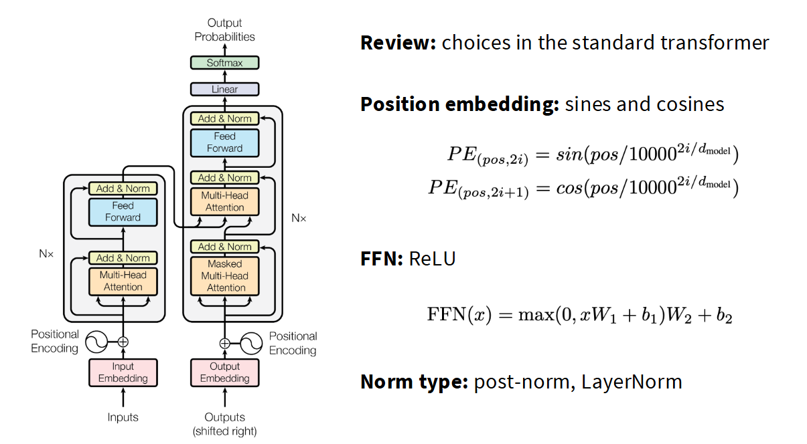
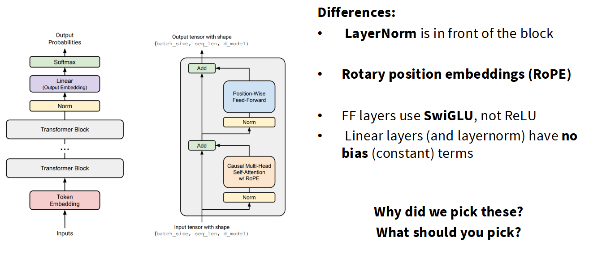
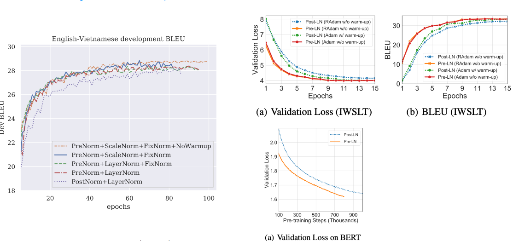
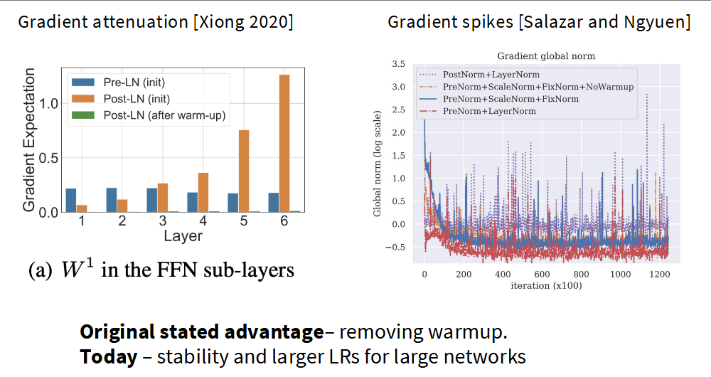
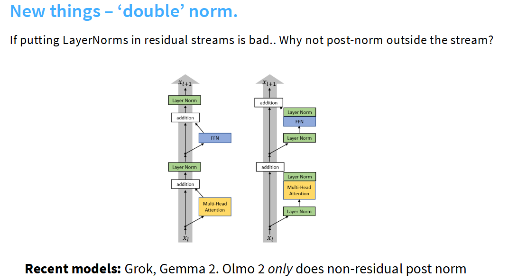
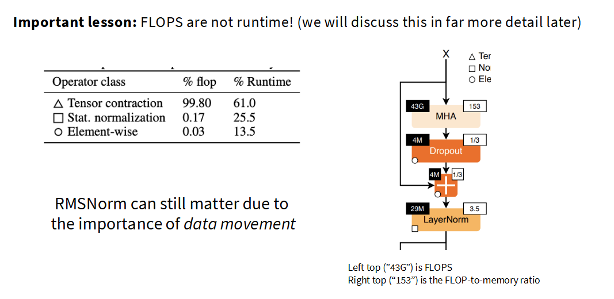
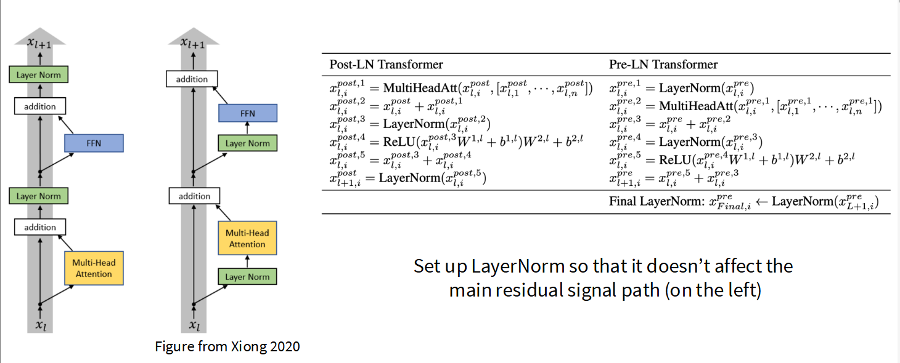
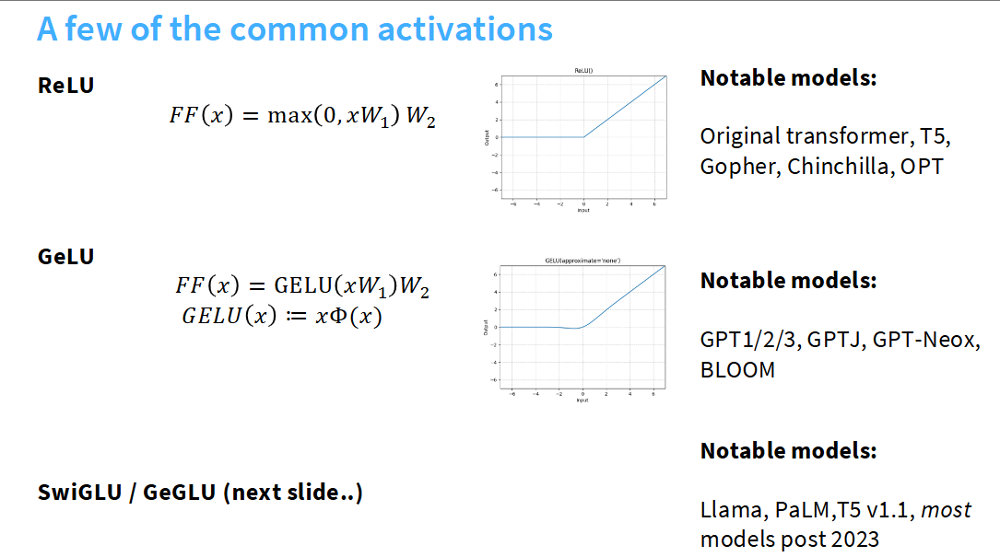

# CS336  关于语言模型架构与训练的一切 - 讲座3笔记

本讲座将深入探讨Transformer架构的演进细节和训练中的超参数选择,这些细节往往在其他课程中被略过. 我们将从一个更偏向数据驱动的视角,通过分析过去几年中发布的大量大型语言模型(LLM),来理解哪些架构选择是至关重要的,哪些已经成为共识.

本次讲座的主题是:**最好的学习方式是亲身实践,而第二好的方式是从他人的经验中学习.**

> 这节课老师语速快的可怕,信息密度大得惊人,一次性消化很困难,建议多听几遍,预习,正式学习,复习都要用起来

## 1. Transformer 架构回顾:从经典到现代

### 原始 Transformer

我们以经典的 `Transformer`架构为起点,它包括了大家熟知的几个部分:

- **位置编码 (Positional Encoding)**: 使用正弦和余弦函数.
- **核心块**: 每个块包含一个多头自注意力(Multi-Head Self-Attention)层和一个前馈网络(Feed-Forward Network, FFN).
- **残差连接与规范化**: 在每个子层(注意力、FFN)之后进行加法(Add)和层规范化(Norm),这被称为**Post-Norm**.
- **输出层**: 最后通过一个线性层和Softmax函数得到概率分布.

### 现代 Transformer 变体

然而,你在课程作业中实现的并非原始版本,而是一个更现代的变体. 主要区别在于:

- **规范化层前置 (Pre-Norm)**: [Normalization Strategies in Transformers](./Lecture3-Normalization-Strategies.md) 是现代架构的基石之一. 规范化层(LayerNorm)被移到了注意力层和FFN层**之前**.
- **旋转位置编码 (RoPE)**: 我们使用 [Rotary Position Embeddings (RoPE)](./Lecture3-Rotary-Position-Embeddings.md),这是一种更先进的位置编码方法.
- **门控激活单元 (GLU)**: 前馈网络层(FFN)使用 [Gated Activations (GLU)](./Lecture3-Gated-Activations.md),特别是SwiGLU,而不是标准的ReLU.
- **无偏置项**: 线性层和规范化层中通常省略了偏置(bias)项.

这些改变并非随意为之,它们是过去数年里,从大量模型(如Llama系列、PaLM、GPT系列等)的实践中演化出的共识.

| 模型名称 (Model Name)        | 年份 (# Year) | 规范化 (Norm) | 并行层 (Parallel Layer) | Pre-norm | 位置编码 (Position Embedding) | 激活函数 (Activations) | 稳定性技巧 (Stability Tricks)     |
| :--------------------------- | :------------ | :------------ | :---------------------- | :------- | :---------------------------- | :--------------------- | :-------------------------------- |
| Original transformer         | 2017          | LayerNorm     | Serial                  | ☐       | Sine                          | ReLU                   |                                   |
| GPT                          | 2018          | LayerNorm     | Serial                  | ☐       | Absolute                      | GeLU                   |                                   |
| T5 (11B)                     | 2019          | RMSNorm       | Serial                  | ☑       | Relative                      | ReLU                   |                                   |
| GPT2                         | 2019          | LayerNorm     | Serial                  | ☑       | Absolute                      | GeLU                   |                                   |
| T5 (XXL 11B) v1.1            | 2020          | RMSNorm       | Serial                  | ☑       | Relative                      | GeGLU                  |                                   |
| mT5                          | 2020          | RMSNorm       | Serial                  | ☑       | Relative                      | GeGLU                  |                                   |
| GPT3 (175B)                  | 2020          | LayerNorm     | Serial                  | ☑       | Absolute                      | GeLU                   |                                   |
| GPTJ                         | 2021          | LayerNorm     | Parallel                | ☑       | RoPE                          | GeLU                   |                                   |
| LaMDA                        | 2021          |               |                         | ☑       | Relative                      | GeGLU                  |                                   |
| Anthropic LM (not claude)    | 2021          |               |                         | ☑       |                               |                        |                                   |
| Gopher (280B)                | 2021          | RMSNorm       | Serial                  | ☑       | Relative                      | ReLU                   |                                   |
| GPT-NeoX                     | 2022          | LayerNorm     | Parallel                | ☑       | RoPE                          | GeLU                   |                                   |
| BLOOM (175B)                 | 2022          | LayerNorm     | Serial                  | ☑       | AliBi                         | GeLU                   |                                   |
| OPT (175B)                   | 2022          | LayerNorm     | Serial                  | ☑       | Absolute                      | ReLU                   |                                   |
| PaLM (540B)                  | 2022          | RMSNorm       | Parallel                | ☑       | RoPE                          | SwiGLU                 | Z-loss                            |
| Chinchilla                   | 2022          | RMSNorm       | Serial                  | ☑       | Relative                      | ReLU                   |                                   |
| Mistral (7B)                 | 2023          | RMSNorm       | Serial                  | ☑       | RoPE                          | SwiGLU                 |                                   |
| LLaMA2 (70B)                 | 2023          | RMSNorm       | Serial                  | ☑       | RoPE                          | SwiGLU                 |                                   |
| LLaMA (65B)                  | 2023          | RMSNorm       | Serial                  | ☑       | RoPE                          | SwiGLU                 |                                   |
| GPT4                         | 2023          |               |                         | ☐       |                               |                        |                                   |
| Olmo 2                       | 2024          | RMSNorm       | Serial                  | ☐       | RoPE                          | SwiGLU                 | Z-loss, QK-norm                   |
| Gemma 2 (27B)                | 2024          | RMSNorm       | Serial                  | ☐       | RoPE                          | GeGLU                  | Logit soft capping, Pre+post norm |
| Nemotron-4 (340B)            | 2024          | LayerNorm     | Serial                  | ☑       | RoPE                          | SqRelu                 |                                   |
| Qwen 2 (72b) - same for 2.5  | 2024          | RMSNorm       | Serial                  | ☑       | RoPE                          | SwiGLU                 |                                   |
| Falcon 2 11B                 | 2024          | LayerNorm     | Parallel                | ☑       | RoPE                          | GeLU                   | Z-loss                            |
| Phi3 (small) - same for phi4 | 2024          | RMSNorm       | Serial                  | ☑       | RoPE                          | GeGLU                  |                                   |
| Llama 3 (70B)                | 2024          | RMSNorm       | Serial                  | ☑       | RoPE                          | SwiGLU                 |                                   |
| Reka Flash                   | 2024          | RMSNorm       | Serial                  | ☑       | RoPE                          | SwiGLU                 |                                   |
| Command R+                   | 2024          | LayerNorm     | Parallel                | ☑       | RoPE                          | SwiGLU                 |                                   |
| OLMO                         | 2024          | RMSNorm       | Serial                  | ☑       | RoPE                          | SwiGLU                 |                                   |
| Qwen (14B)                   | 2024          | RMSNorm       | Serial                  | ☑       | RoPE                          | SwiGLU                 |                                   |
| DeepSeek (67B)               | 2024          | RMSNorm       | Serial                  | ☑       | RoPE                          | SwiGLU                 |                                   |
| Yi (34B)                     | 2024          | RMSNorm       | Serial                  | ☑       | RoPE                          | SwiGLU                 |                                   |
| Mixtral of Experts           | 2024          |               |                         | ☐       |                               |                        |                                   |
| Command A                    | 2025          | LayerNorm     | Parallel                | ☐       | Hybrid (RoPE+NoPE)            | SwiGLU                 |                                   |
| Gemma 3                      | 2025          | RMSNorm       | Serial                  | ☐       | RoPE                          | GeGLU                  | Pre+post norm, QK-norm            |
| SmolLM2 (1.7B)               | 2025          | RMSNorm       | Serial                  | ☐       | RoPE                          | SwiGLU                 |                                   |

[主流大模型演进历程](%E4%B8%BB%E6%B5%81%E5%A4%A7%E6%A8%A1%E5%9E%8B%E6%BC%94%E8%BF%9B%E5%8E%86%E7%A8%8B.md)

## 2. 核心架构变体分析

### 规范化:位置与类型

现代Transformer架构在规范化上有两大共识:

1. **位置 (****`Pre-Norm`** **Pre-Norm** ): 几乎所有现代模型都采用 `Pre-Norm`结构,即将规范化层放在残差连接的主路径之外、每个子模块(注意力/FFN)的输入端. 这极大地增强了训练的稳定性,缓解了梯度消失或爆炸问题,使得训练更深的网络成为可能.

   使用 `Pre-Norm`这是在最开始就成为业界共识的事情,但是原始的Transformer模型却采用了 `Post-Norm`

   很早的时候研究者们就发现,将归一化模块前置到非残差模块前端(例如FFN,MHA)能在多项指标上表现更优.

学界也对这些优势做了许多解释

- **跨层梯度衰减**:预归一化能使梯度幅值保持稳定,而未经预热的后归一化则会出现梯度爆炸

但目前的主流解释是. 预归一化本身就是更稳定的训练架构,因此现在它主要作为稳定训练的手段. 如下图右图,后归一化中梯度范数的峰值出现更频繁.

这就引入了一个巨大的创新点:

- 为什么规范化层不能放在前馈网络之后呢？Omo2采用
- 为什么不能前后都放一个归一化呢？Grok&Gemma2采用了这个方案
- 为什么不能多放几个呢？

但最近有一些创新方案,在后面会详述

2. **类型 (****`RMSNorm`** **RMSNorm** ): 许多模型已从 `LayerNorm`转向 `RMSNorm`. `RMSNorm`简化了计算(不计算均值),减少了参数和内存移动,从而在保持模型性能的同时提升了训练速度.

   - LayerNorm代表模型: GPT1/2/3,OPT,GPT-J,BLOOM

     $$
     y = \frac{x - \mathbb{E}[x]}{\sqrt{\text{Var}[x] + \epsilon}} \cdot \gamma + \beta  \quad(LayerNorm 公式)
     $$
   - RMSNorm代表模型: Llama系列,PaLM,Chinchilla,T5

     $$
     y = \frac{x}{\sqrt{||x||_2^2 + \epsilon}} \cdot \gamma \quad (RMSNorm 公式)
     $$

但是两种Norm差别不大,是为了简化模型才用的RMSNorm,而且RMSNorm速度更快,因为省略了均值计算,而且减少了bias参数量,从而减少参数数量

> 在cs224中老师讲过,训练模型的时候唯一重要的是矩阵乘法,其他的无需关心. 这个观点确实有合理性,至于更详细的分析 在ivanov的2021年论文《Data Movement Is All You Need: A Case Study on Optimizing Transformers》详细分析了Transformer模型中不同运算的占比情况.(老师口误成2023年,而且论文名字也不记得,我想应该是这一篇)

大致的分析如下

矩阵乘法类运算占比高达99.8%,似乎节省0.17%的Norm运算毫无意义. 但现代LLM结构中,不光关注浮点操作. 因此浮点操作固然重要,但并非唯一考量,内存移动优化同样重要. 实际上Norm操作占用了25%的运行时间,因为Norm操作会带来巨大的内存搬运开销. 性能不能光考虑浮点计算能力,还要考虑内存访问效率

图中是一些主要研究,其中Naron团队在2020年的消融实验很有代表性. 可以看到 RMS Norm每秒处理的迭代次数相比标准Transformer ,从3.5/s达到了3.68/s. 虽然提升幅度不大,但这是零成本得到的,最重要的是最终的损失函数比Transformer低,可以说实现了运行效率的提升.

这两个选择的背后,是业界对**训练稳定性**和系统效率(尤其是内存带宽)的深刻理解.

> **[深度解析]** 关于 `Pre-Norm`为何优于 `Post-Norm`,`RMSNorm`相比 `LayerNorm`的效率优势,以及最新的“双重规范化”趋势,请参阅 [Normalization Strategies in Transformers](./Lecture3-Normalization-Strategies.md).

> **[深度解析]** 为什么将层归一化(Layer Normalization, LN)放在残差连接内部(即 Pre-Norm)通常是更好的选择 [为什么这样做是对的？](Lecture3-Where-to-put-Norm-and-why.md)

在FFN中 ,也采用了类似的思想 直接去掉了 bias项

$$
\text{FFN}(x) = \max(0, xW_1 + b_1)W_2 + b_2 \quad(Original \quad Transformer)
$$

$$
\text{FFN}(x) = \sigma(xW_1)W_2 \quad(Most \quad Implementations)
$$

这同样增加了训练的稳定性,但老师都没完全理解为什么偏置项会损害训练的稳定性

总结:👇

> - 基本上所有人都使用 Pre-Norm (前置归一化).

> - **直觉:** 保留残差连接的优点.
> - **观察:** 更平滑的梯度传播,更少的尖峰.
> - **补充:** 有些人会在残差流之外添加第二个归一化层(但不是 Post-Norm).

**大多数人使用 RMSNorm**.

> - **实践中:** 效果与 LayerNorm (层归一化) 一样好.
> - **优点:** 参数更少,节省了实际运行时间(wallclock time).
> - **趋势:** 人们通常会去掉偏置项(bias terms),因为计算/参数的权衡并不理想.
> - Llama,Cohere,Command R都依然采用传统的LN,原因不明

### 激活函数:门控机制的胜利

激活函数的选择也经历了演变.

- **早期模型**: 使用**ReLU** (如原始Transformer, T5) 或**GeLU** (如GPT系列).
- **现代模型**: 绝大多数模型,特别是2023年之后发布的,都转向了**门控线性单元(Gated Linear Units, GLU)的变体,如SwiGLU** (Llama, PaLM) 和**GeGLU** (T5-v1.1, Gemma).

其中,V这个参数矩阵通常按照w的2/3来设置,这没有什么数学解释,只是工程实践. (后面会再详细解释)

实验反复证明,门控激活能持续带来性能提升. 门控机制通过一个与输入相关的“门”来动态控制信息流,赋予了网络更强的表达能力.

但是GPT3就是一个不使用GLU就性能很好的一个例子,还有Nemotron340b(Squared ReLU)和Falcon2-11b(RELU)

> **[深度解析]** 门控机制是什么？为什么它比简单的非线性函数更有效？请参阅 [Gated Activations (GLU)](./Lecture3-Gated-Activations.md).

### 位置编码:RoPE 的主导地位

位置编码是让模型理解序列顺序的关键.

- **早期方法**: 包括加性的**绝对位置编码**(GPT-1/2/3)或基于**正弦/余弦**的编码(原始Transformer). 而GoPher，T5等模型采用了多种相对位置嵌入方法
- **现代标准**: **旋转位置编码 (RoPE)** 已成为绝对的主流. 它的核心思想是通过旋转操作将相对位置信息融入到查询(Query)和键(Key)向量中,理论上更优雅且在长序列上表现更佳.  这是GPT-J最早使用的，也是开源社区的贡献 @苏剑林

> **[深度解析]** RoPE如何通过旋转实现相对位置编码？其背后的数学原理和实现细节是怎样的？请参阅 [Rotary Position Embeddings (RoPE)](./Lecture3-Rotary-Position-Embeddings.md).

### 串行 vs. 并行层

标准的Transformer块是**串行**的:输入先经过注意力层,其输出再经过FFN层.

- **并行层**: 一些模型(如GPT-J, PaLM)尝试过**并行**结构,即让注意力和FFN层同时处理相同的输入,然后将它们的输出相加.

  - **优势**: 理论上可以融合矩阵乘法,提升计算并行度,从而加速训练.
  - **现状**: 尽管有此优势,但目前大多数模型仍采用串行结构,这可能意味着串行结构在表达能力上更具优势.

## 3. 超参数选择:不成文的规则

在训练LLM时,许多超参数的选择实际上遵循着惊人的共识.

- **前馈网络维度比例 (***`d_ff / d_model`* ):

  - 对于使用ReLU/GeLU的模型,一个经典的“经验法则”是 `d_ff = 4 * d_model`.
  - 对于使用GLU变体的模型,为了保持参数量相近,这个比例通常调整为 `d_ff ≈ (8/3) * d_model ≈ 2.67 * d_model`.
  - **例外**: T5模型曾大胆地使用了高达64倍的比例,但其后续版本T5-v1.1又回归到了更标准的2.5倍,这暗示了超大比例可能并非最优.
- **模型宽高比 (***`d_model / n_layer`** ):

  - 这个比例衡量了模型的“宽度”(隐藏层维度)与“深度”(层数).
  - 大多数成功的模型似乎都找到了一个“甜蜜点”,该值大约在**100到200**之间. 例如,GPT-3、OPT、Mistral等模型的宽高比都在128左右.
  - 这个选择也受到系统并行化策略的影响:极深的模型有利于流水线并行,而极宽的模型有利于张量并行.
- **词汇表大小 (Vocabulary Size)**:

  - **单语模型**: 通常在3万到5万之间(如GPT-2/3, LLaMA).
  - **多语/生产系统**: 趋向于更大的词汇表,通常在10万到25万之间(如mT5, PaLM, GPT-4, Command A). 这是为了更好地支持多语言、特殊符号和代码等.
- **正则化 (Regularization)**:

  - **Dropout**: 在早期的模型中很常见,但在现代LLM的**预训练**阶段已基本弃用. 因为预训练数据量巨大,模型通常只过一遍数据,过拟合风险很低.
  - **权重衰减 (Weight Decay)**: 仍然被广泛使用,但其作用很奇特. 它主要不是为了防止过拟合,而是通过与学习率调度(特别是cosine schedule)的复杂相互作用,来改善训练末期的优化动态,从而获得更低的训练损失.

## 4. 推理效率与高级注意力机制

### GQA/MQA:为高效推理而设计

在模型训练时,我们可以并行处理整个批次,算力利用率高. 但在**自回归生成(推理)**时,模型必须逐个token生成,这导致了所谓的“KV缓存”瓶颈,即读写巨大的Key和Value缓存成为性能瓶颈,内存带宽而非计算能力成为限制因素.

- **多查询注意力 (MQA)** 和 **分组查询注意力 (GQA)** 正是为此而生. 它们通过让多个查询头(Query heads)共享同一组或几组键/值头(Key/Value heads),极大地减小了KV缓存的大小,从而显著提升了推理速度和吞吐量.

> **[深度解析]** 为何推理时的计算模式与训练时完全不同？KV缓存瓶颈是如何产生的？MQA/GQA又是如何从根本上解决这个问题的？请参阅 [Grouped-Query & Multi-Query Attention (GQA/MQA)](./Lecture3-GQA-MQA.md).

### **稀疏与滑动窗口注意力**

为了处理更长的上下文,研究人员提出了多种方法来避免计算完整的(二次复杂度的)注意力矩阵.

- **滑动窗口注意力 (Sliding Window Attention)**: 每个token只关注其邻近的一个窗口内的其他token.
- **稀疏注意力 (Sparse Attention)**: 设计更复杂的、非局部的注意力模式,如跨步(strided)或固定(fixed)模式.
- **现代混合策略**: 最新的长上下文模型(如Llama 4, Command A)采用了一种巧妙的混合策略:大部分层使用带RoPE的滑动窗口注意力来处理局部信息,同时每隔几层插入一个**不带位置编码的全局注意力层**来整合长距离信息. 这种设计兼顾了效率和长程依赖的建模能力.

### **训练稳定性技巧**

随着模型规模的增大,训练稳定性变得至关重要. 不稳定的训练表现为损失函数突然出现尖峰(spikes).

- **问题的根源**: `softmax`函数的指数和除法操作是数值不稳定的主要来源,这在输出层和注意力层都存在.
- **解决方案**:

  - **Z-Loss**: 在最终的损失函数中加入一个辅助项,惩罚输出层softmax的归一化因子 `Z`偏离1,从而使其行为更稳定.
  - **QK Norm**: 在计算注意力分数前,对查询(Q)和键(K)向量分别进行LayerNorm. 这能有效控制输入到softmax的值的范围,防止其爆炸.

    这些技巧,尤其是QK Norm,再次凸显了**规范化**在稳定大型模型训练中的神奇效果.
