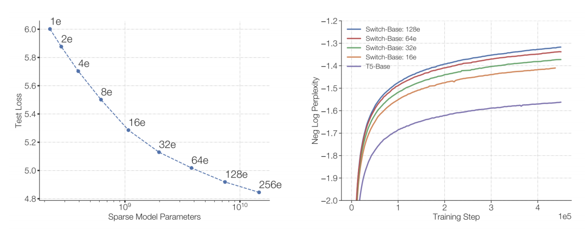
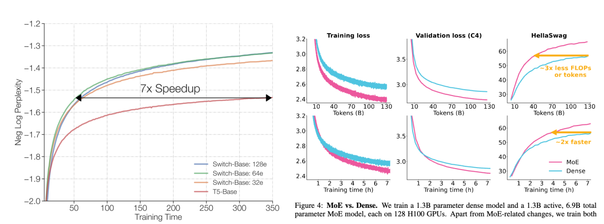
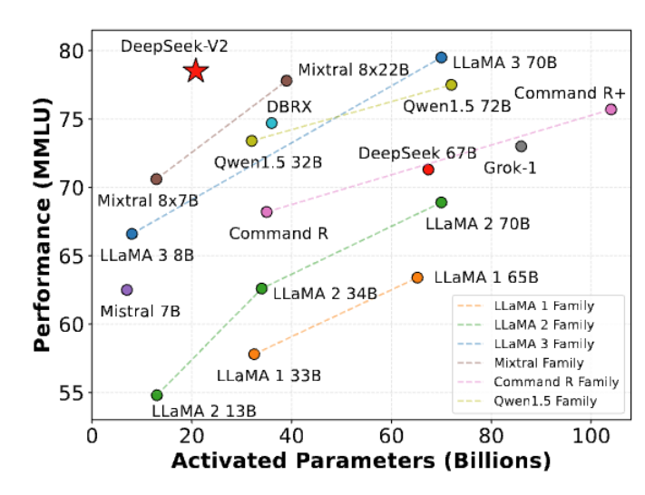
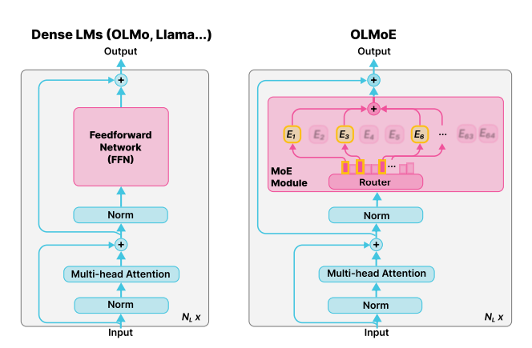

# 第四讲:混合专家模型 (Mixture of Experts) 详解

> 这节课的学生提问是真的多，而且这节课的结构我觉得老师讲的不算很好，有点乱

## 1. MoE为何成为前沿模型的主流架构？

混合专家模型 (Mixture of Experts, MoE) 已经成为当今最高性能语言模型(如GPT-4, Llama 4, Grok, DeepSeek系列)的核心架构. 截至2025年, MoE架构相对于传统“稠密” (Dense) 架构的优势已非常明确:在几乎所有计算规模下, 只要训练得当, MoE模型都能在相同的算力(FLOPs)消耗下获得比稠密模型更优的性能.

### 1.1 MoE的核心思想:用更多参数, 但不增加计算量

MoE的理念出奇地简单. 传统的Transformer模型在每一层都有一个前馈网络(FFN), 所有输入令牌(token)都必须经过这个FFN进行计算.

- **稠密模型 (Dense Model)**:一个大的FFN层.
- **MoE模型 (Sparse Model)**:将单个FFN替换为多个更小的FFN“专家”, 并增加一个“路由器”(Router)层.

如下图所示, 对于每个传入的Token, 路由器会**稀疏地**选择激活一小部分专家(例如, 只激活2个专家)来进行计算.

这个设计的最大优势在于:**在不增加推理/训练计算量(FLOPs)的前提下, 大幅增加模型的总参数量**. 例如, 一个拥有8个专家的MoE模型, 如果每次只激活1个专家, 其总参数量约等于稠密模型的8倍, 但推理的计算成本却几乎与稠密模型相同. 对于相信“更多参数能够记忆更多世界知识”的观点来说, 这无疑是一种极具吸引力的架构.

### 1.2 性能优势的实证

大量研究表明, 在相同的训练计算量下, MoE模型能更快地降低损失函数, 达到更高的性能.

- **谷歌的经典研究** 显示, 随着专家数量的增加(从1个到256个), 模型的测试损失持续下降（keep going own and down and down ）.
  

  这并非没有代价，需要考虑每个专家的内存，还要考虑多专家路由，这会带来很高的系统复杂性，并且专家数量多容易训飞
  [Switch Transformers: Scaling to Trillion Parameter Models with Simple and Efficient Sparsity](https://arxiv.org/abs/2101.03961)
- **AI2的Olmo模型** 的严格对比实验也验证了这一点, MoE模型(粉色线)的训练损失下降速度远快于稠密模型(蓝色线).
  
  [OLMoE: Open Mixture-of-Experts Language Models](https://arxiv.org/abs/2409.02060)

  这个团队做了一系列消融实验，对Dense和MoE模型精心控制过的比较
  
  这种特性使得MoE模型在性能-计算成本的权衡上极具竞争力, 这也是DeepSeek-V2等模型能在“激活参数”较少的情况下, 在MMLU等基准测试上取得优异成绩的原因.

## 2. MoE架构的设计选择

为什么MoE模型在DeepSeek-R1-0128之前没有那么流行以至于它都没有入选cs224n的常规内容呢？因为它很复杂而且很麻烦

它最大的优势体现在进行多节点训练时的方便，但这需要强大的Infra和分布式训练框架支撑

因此，在模型参数量没有那么大，以至于把模型放到不同设备上一起训练的时候，MoE并没有那么有优势，Google早期的论文提到了这一点

[A Review of Sparse Expert Models in Deep Learning](https://arxiv.org/abs/2209.01667)

而且，把Token分配给哪个Expert是很难的事情，因为它甚至不可微，没有梯度，因此优化变得格外困难

### 那么MoE长什么样呢？

> 人家的图画的真的很好看

构建一个MoE模型主要涉及三个核心设计问题:

1. **路由功能 (Routing Function)**: 如何智能地为每个令牌选择最合适的专家？
2. **专家规模 (Expert Sizes)**: 需要多少个专家？每个专家应该多大？
3. **训练目标 (Training Objectives)**: 如何训练这个包含离散、不可微路由决策的复杂系统？

### 2.1 路由功能:令牌选择Top-K

路由的本质是解决令牌与专家之间的匹配问题. 理论上存在多种方式:

- **令牌选择 (Token Choice)**:每个令牌根据亲和度对所有专家进行排序, 选择最匹配的Top-K个专家.
- **专家选择 (Expert Choice)**:每个专家对所有令牌进行排序, 选择自己最想处理的Top-K个令牌.
- **全局分配 (Global Assignment)**:通过复杂的优化算法, 寻找一个全局最优的令牌-专家分配方案.
- 哈希路由：神奇的是，即使直接用哈希路由，不带任何语义信息，也能获得MoE模型效果的提升

**实践中, 几乎所有的现代MoE模型都统一采用了“令牌选择Top-K”的路由策略**. 这种策略最符合直觉:为每个令牌找到最擅长处理它的专家.

Olmo的消融实验也表明, 令牌选择(TC)相比专家选择(EC)能够更快地降低验证损失.

具体的实现细节在 **[Top-K 路由机制详解](./Lecture4-TopK-Routing.md)** 中有深入探讨.

### 2.2 专家规模与配置:细粒度与共享专家

早期的MoE模型通常是将稠密模型中的FFN层复制多份. 然而, DeepSeek在其MoE系列中引入了两项重要创新, 并被后续许多开源模型采纳:

1. **细粒度专家 (Fine-grained Experts)**:这个设计的核心思想是“在不增加参数成本的前提下, 拥有更多专家”. 传统FFN的中间层维度通常是隐藏层维度的4倍. 细粒度专家则将这个扩展比例缩小, 例如缩小到2倍甚至更小. 这样, 每个专家的参数量变少了, 我们就可以在总参数预算不变的情况下, 创建数量更多的专家. 更多的专家选择通常意味着更好的性能.
2. **共享专家 (Shared Experts)**:在众多需要路由的“细粒度专家”之外, 增加一个或多个所有令牌都必须经过的共享专家. 其背后的直觉是, 某些计算任务可能是所有令牌普适需要的, 用一个共享专家来处理这些共性任务可以提高效率, 避免在每个路由专家中重复学习.

下图直观展示了从传统的Top-2路由, 到加入细粒度专家, 再到引入共享专家的架构演进.

DeepSeek的消融实验证明, 同时使用细粒度专家和共享专家能带来显著的性能提升.

**常见模型配置**:

下表总结了一些近期主流MoE模型的专家配置, 可以观察到“大量路由专家+少量激活专家”以及“细粒度”的趋势.

| Model       | Routed Experts | Active Experts | Shared Experts | Fine-grained Ratio |
| ----------- | -------------- | -------------- | -------------- | ------------------ |
| Mixtral     | 8              | 2              | 0              | (Standard)         |
| DeepSeek v1 | 64             | 6              | 2              | 1/4                |
| Qwen 1.5    | 60             | 4              | 4              | 1/8                |
| DeepSeek v3 | 256            | 8              | 1              | 1/14               |
| Llama 4     | 128            | 1              | 1              | 1/2                |

## 3. MoE的训练挑战与解决方案

MoE训练的核心挑战在于:路由决策是离散的(选择专家A或专家B), 因此本质上是**不可微分的**, 无法直接使用梯度下降进行优化. 此外, 还有一个棘手的问题:**专家负载失衡**. 如果没有干预, 模型在训练初期可能会倾向于将所有令牌都路由到一两个“明星专家”, 导致其他专家从未得到训练, 成为“死亡专家”, 极大地浪费了模型容量.

### 3.1 探索过的路径:强化学习与随机扰动

- **强化学习 (RL)**:将路由决策视为一个RL策略. 这是理论上最完备的方案, 但由于训练复杂度和梯度方差问题, 在实践中效果不佳且未被广泛采用.
- **随机扰动**:在计算路由分数时加入高斯噪声或随机“抖动”(jitter), 强制模型进行探索, 避免过早地锁定在几个专家上. 这种方法在早期Google的论文中被尝试过, 但后来发现其效果不如更简单的启发式损失.

### 3.2 最终的赢家:启发式负载均衡损失

当前所有高性能MoE模型实际上都依赖于一种简单而有效的启发式方法:**添加一个辅助的负载均衡损失函数**. 这个损失函数的目标是惩罚那些导致专家负载不均的路由行为.

这个概念在 **[MoE训练中的负载均衡损失](./Lecture4-Load-Balancing-Losses.md)** 中有详细的数学解释和案例分析. 其核心思想是, 在训练的主损失(如交叉熵损失)之外, 额外增加一个正则化项, 该项会促使路由器将令牌大致均匀地分配给所有专家.

## 4. 系统层面的考量

### 4.1 专家并行:为超大模型解锁新的并行维度

MoE架构天然适合大规模并行化. 一种非常自然的并行方式被称为**专家并行 (Expert Parallelism)**:将不同的专家放置在不同的计算设备(GPU/TPU)上.

当一个令牌需要计算时:

1. 本地设备上的路由器计算出需要激活的专家.
2. 通过一个`All-to-All`的通信操作, 将该令牌的数据发送到持有对应专家的远程设备上.
3. 远程设备完成计算.
4. 计算结果再通过`All-to-All`通信返回.

这种方式与数据并行、模型并行(张量并行、流水线并行)相结合, 为训练万亿参数级别的巨型模型提供了灵活且强大的工具.

### 4.2 MoE模型的内在随机性:令牌丢弃

一个有趣且在实践中需要注意的现象是, MoE模型可能具有内在的随机性, 即使在推理时将温度(temperature)设为0, 对于相同的输入也可能产生不同的输出.

这源于**令牌丢弃 (Token Dropping)**. 为了处理效率和内存限制, 每个专家在一个批次(batch)中能处理的令牌数量是有限的(这个上限被称为`capacity`). 如果路由器向某个专家发送的令牌数量超过了其容量, 多余的令牌就会被直接“丢弃”. 这些被丢弃的令牌不会经过任何专家FFN的计算, 而是直接通过残差连接进入下一层.

由于你在一个批次中的查询结果, 会受到**同批次中其他用户查询内容**的影响(因为他们的查询可能占用了你所需专家的容量), 这就引入了推理时的随机性.

## 5. 案例研究:DeepSeek MoE 架构的演进之路

DeepSeek系列模型是理解现代MoE架构演进的最佳范例.

- **DeepSeek MoE V1 (16B总参数 / 2.8B激活)**:

  - **架构**: 奠定了“共享专家+细粒度专家”的范式(2个共享 + 64个路由专家, 激活6个).
  - **路由**: 采用标准的 **[Top-K 路由](./Lecture4-TopK-Routing.md)**.
  - **训练**: 使用了基础的 **[辅助负载均衡损失](./Lecture4-Load-Balancing-Losses.md)**, 同时在专家和设备两个层级进行平衡.
- **DeepSeek MoE V2 (236B / 21B)**:

  - **架构**: 沿用V1的成功范式, 但规模大幅扩展.
  - **路由创新**: 引入了**Top-M设备路由**. 为了控制在超大规模训练时的通信开销, 路由器不再是全局选择Top-K专家, 而是先选择亲和度最高的M个设备, 然后再在这M个设备上的专家中进行Top-K选择.
  - **训练创新**: 增加了**通信均衡损失**, 不仅平衡计算负载, 还平衡设备间数据输入和输出的通信负载, 进一步提升系统效率.
- **DeepSeek V3 (671B / 37B)**:

  - **架构**: 核心MoE结构保持不变, 证明了其设计的稳健性.
  - **路由微调**: 对路由计算做了一些调整, 如使用Sigmoid代替部分Softmax, 并调整了归一化操作的位置.
  - **训练创新**: 引入“无辅助损失的均衡化”, 通过一个在线学习的偏置项(bias)来动态调整每个专家的吸引力, 以替代V1/V2中的部分辅助损失. 但为了保证单一样本内的均衡, 仍然保留了一个“互补的序列级辅助损失”.
  - **非MoE创新**:

    - **[多头潜在注意力 (MLA)](./Lecture4-MLA-Attention.md)**: 一种新颖的注意力机制, 通过将Key和Value投影到更低的“潜在”维度来大幅压缩KV缓存, 对长序列推理至关重要.
    - **多令牌预测 (MTP)**: 训练一个轻量级的“预测头”, 让模型不仅预测下一个令牌, 还同时预测下下个令牌, 作为一种辅助训练目标.

## 6. 总结

MoE架构通过“稀疏激活”的核心思想, 成功地在控制计算成本的同时, 极大地扩展了模型参数规模, 成为构建SOTA(State-of-the-art)大语言模型的关键. 其设计和训练虽然充满挑战, 特别是离散路由和负载均衡问题, 但通过以**Top-K路由**和**启发式均衡损失**为代表的一系列创新, 已经形成了一套成熟且高效的解决方案. DeepSeek等模型的演进, 清晰地展示了这条从理论到大规模实践的技术路径.
