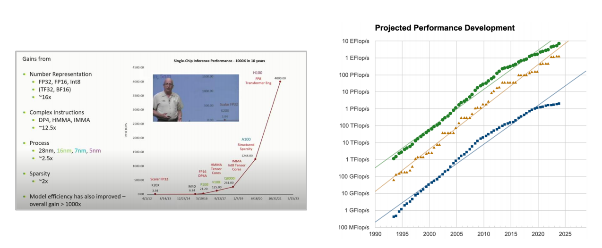
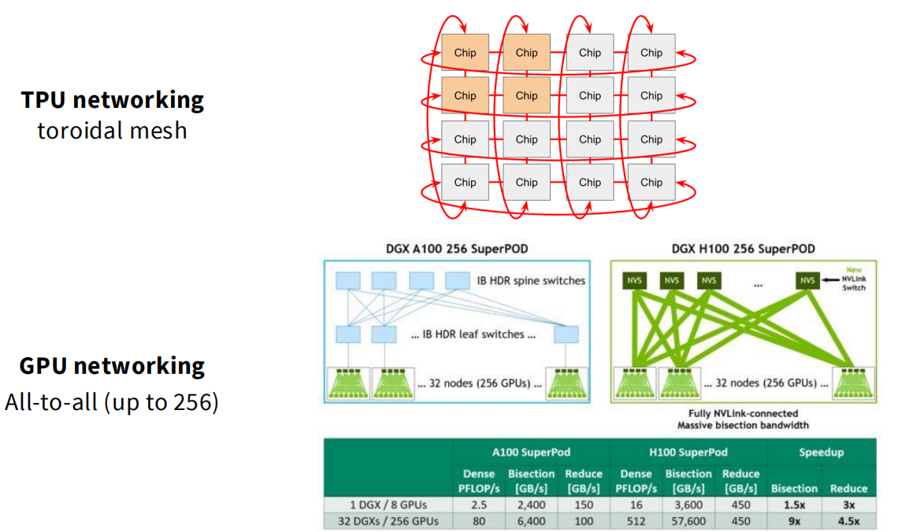
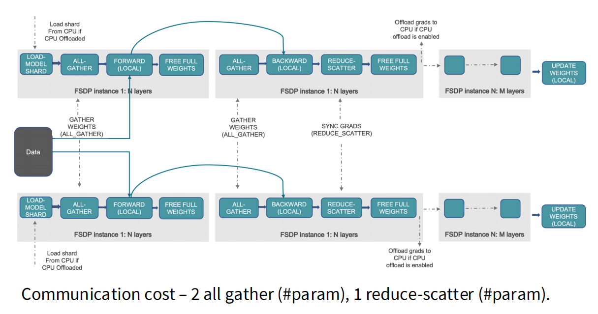
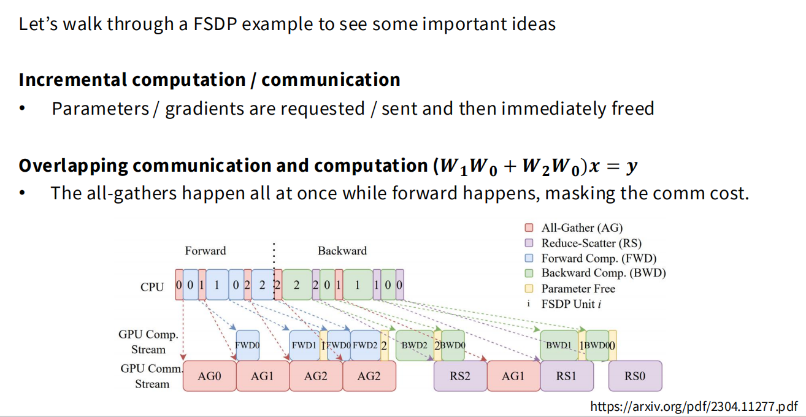
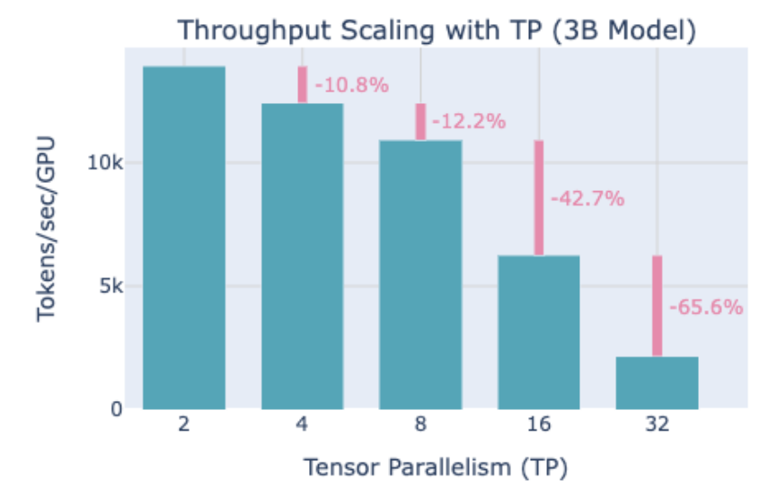
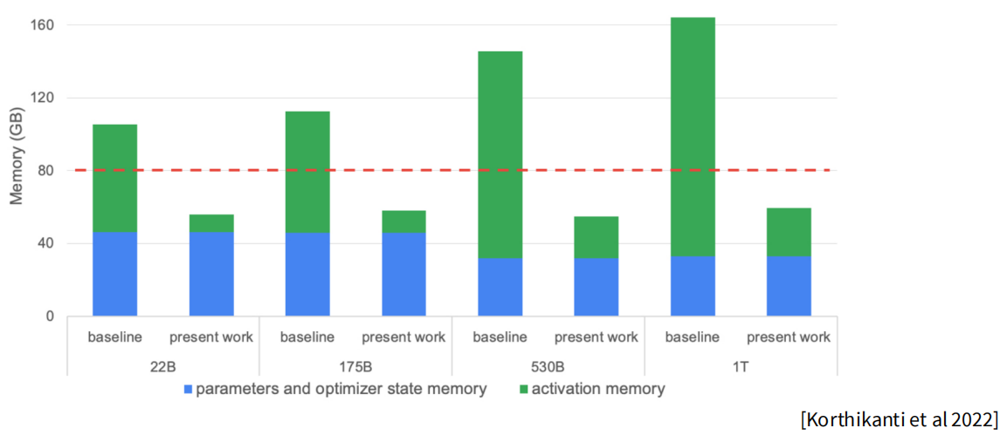

# Lecture 7: 并行化基础 (Parallelism Basics)

## 1. 引言:从单机到数据中心 (Introduction)

在前几节课中, 我们专注于优化单个 GPU 的吞吐量 (例如 FlashAttention, 矩阵乘法优化). 然而, 随着模型规模的指数级增长, 我们面临着两个不可逾越的墙:

1. **计算墙 (Compute Wall)**: 要训练当今最强大的语言模型, 我们需要百亿亿次级 (**Exaflops**) 的算力. 单个 GPU 的性能提升速度远跟不上模型规模的增长, 我们必须依赖世界上最快的超级计算机集群.
   

> projected performance development, 展示了超算和单芯片性能的指数级增长曲线.

2. **内存墙 (Memory Wall)**: 模型参数量已达数千亿甚至万亿级别, 单个 GPU 的显存根本无法容纳完整的模型参数、梯度和优化器状态.
   

> Model Size over time, 展示了从 ELMo 到 Megatron-Turing NLG 530B 的模型规模增长趋势.

因此, 我们的计算单元不再是单个 GPU, 而是**整个数据中心**. 本节课的目标是理解如何利用多机环境, 实现**线性内存扩展** (可训练模型大小随 GPU 数量线性增加) 和**线性计算扩展** (总吞吐量随 GPU 数量线性增加).

## 2. 硬件背景与通信原语 (Hardware Context & Communication Primitives)

在设计并行策略之前, 必须理解底层的硬件连接层级, 因为这决定了通信带宽和延迟. 环境是高度异构的.

### 2.1 连接的层级 (Hardware Hierarchy)

> 一个典型的高性能计算节点架构图, 展示了 CPU, GPU, 以及不同层级的互连技术.

* **节点内 (Intra-node) 通信**: 这指的是在**同一台物理服务器**内部的设备间通信. 其核心特征是极高的带宽和极低的延迟. 对于大模型训练中最高频的 **GPU-to-GPU 通信**, 数据会通过专用的高速通道流转. 在此图中, 当 `GPU0` 需要与 `GPU7` 通信时, 数据会通过绿色的 **NVLink** 线路进入 **NVSwitch** 交换矩阵. 这个矩阵是一个全连接的网络, 专门为 GPU 间的数据交换设计, 提供了高达 400 GT/s 的惊人带宽. 这是实现**张量并行 (Tensor Parallelism)** 等需要海量、低延迟通信策略的物理基础. 相比之下, CPU 与 GPU 间的通信则通过速度较慢的 **PCI Express 4.0** 总线, 经由 **PLX** (PCIe 交换机) 进行, 这通常用于任务分发或数据加载, 而非密集的计算中同步.
* **节点间 (Inter-node) 通信**: 当通信需要**跨越不同的物理服务器**时, 数据流路径变得更长且速度显著降低. 此时, 数据无法再使用节点内的 NVLink/NVSwitch 专线. 以 `GPU0` 向另一台服务器上的 GPU 发送数据为例, 数据必须先“向上”离开 GPU, 路径如下: 数据从 `GPU0` 出发, 通过 **PCI Express 4.0** 总线到达 **PLX** 交换机, 接着被路由到 **HCA (Host Channel Adapter)**, 在本图中即 HDR **InfiniBand** 网卡. HCA 是节点与外部世界连接的网关, 它将数据打包并通过外部网络 (如图中紫色的 `Switch0`, `Switch1` 所代表的外部交换机) 发送到目标服务器. 目标服务器的 HCA 接收数据后, 再通过其内部的 PCIe 总线将数据传递给目标 GPU. 整个过程不仅速度受限于带宽较低的 InfiniBand 网络 (50 GT/s), 而且每一步都会引入额外的延迟. 因此, 节点间通信更适合**数据并行 (Data Parallelism)** 或**流水线并行 (Pipeline Parallelism)** 这类对延迟不那么敏感的策略.
* **规模阈值 (Scale Thresholds)**: 当 GPU 集群规模较小 (例如在一个“机柜”或“SuperPOD”内, 通常最多 256 个 GPU) 时, 外部网络可以被设计成具有很高的“对分带宽”, 确保任意两个节点间的通信性能都相对均衡. 然而, 当集群规模扩展到数千甚至上万个 GPU 时, 维持这种全连接的网络成本极高. 网络会呈现更复杂的层级结构, 例如“叶脊 (Leaf-Spine)”架构. 在这种情况下, 两个远端节点间的通信可能需要经过多个网络交换机的“跳跃”, 每一跳都会增加延迟并可能遇到拥塞. 这就是为什么在超大规模训练中, 并行策略的选择必须充分考虑网络拓扑, 尽量将通信密集型任务 (如张量并行) 限制在通信最快的单元内, 而将对延迟容忍度更高的任务 (如数据并行) 部署在更广阔的集群范围.

> **对比视角:TPU**
> Google 的 TPU 采用不同的网络设计, 称为**环形网格 (Toroidal Mesh)**. 芯片只与邻居进行极快速的通信. 这种结构非常适合实现特定的集体通信操作, 且扩展性极好, 不像 GPU 那样在跨越特定规模时出现显著的带宽下降.

### 2.2 集体通信原语 (Collective Communication Primitives)

所有高级的并行算法最终都是通过调用底层的**集体通信原语**来实现的. 理解它们及其成本是分析并行效率的基础.

> 图 2: 分布式计算中常用的五种集体通信操作.

上图直观地展示了五种核心集体通信原语 (All-Reduce, Broadcast, Reduce, All-Gather, Reduce-Scatter) 这些核心操作, 它们是构建复杂并行策略的基石:

- **All-Reduce (全规约)**

  - **核心概念**: 对所有 `rank` (计算单元, 如 GPU) 的输入数据执行一个规约操作 (如求和), 并将最终的**相同结果**分发给**所有**参与的 `rank`.
  - **数据流详解**:
    - **初始状态**: 每个 `rank` 持有一个独立的输入缓冲区. 例如, `rank 0` 持有 `in0`, `rank 1` 持有 `in1`, `rank 2` 持有 `in2`, `rank 3` 持有 `in3`.
    - **操作过程**: 系统逻辑上收集所有输入 (`in0` 到 `in3`), 对它们进行逐元素求和, 得到一个最终的聚合结果 `out = in0 + in1 + in2 + in3`. 随后, 这个单一的聚合结果 `out` 被广播回所有参与的 `rank`.
    - **最终状态**: 操作完成后, `rank 0` 到 `rank 3` 的输出缓冲区中都包含了完全相同的聚合结果 `out`. 这是一个 "多对多" (many-to-many) 的同步操作.
- **Broadcast (广播)**

  - **核心概念**: 一个指定的 `rank` (称为 `root`) 将其持有的数据**精确复制**给所有其他的 `rank`.
  - **数据流详解**:
    - **初始状态**: 只有一个 `rank` (图中以 `rank 2` 为例) 在其输入缓冲区中持有有效数据 `in`. 其他 `rank` 的相应缓冲区是空的或将被覆盖.
    - **操作过程**: `root` `rank` (`rank 2`) 将其数据 `in` 发送出去. 网络基础设施将这份数据复制并分发给所有其他 `rank` (`rank 0`, `rank 1`, `rank 3`).
    - **最终状态**: 所有 `rank` (`rank 0` 到 `rank 3`) 的输出缓冲区中都包含了与 `root` `rank` 原始数据 `in` 完全相同的一份副本. 这是一个 "一对多" (one-to-many) 的分发操作.
- **Reduce (规约)**

  - **核心概念**: 对所有 `rank` 的输入数据进行规约操作, 但最终结果**只发送给一个**指定的 `root` `rank`.
  - **数据流详解**:
    - **初始状态**: 与 All-Reduce 相同, 每个 `rank` 都持有自己的输入数据 (`in0` 到 `in3`).
    - **操作过程**: 系统逻辑上收集所有输入, 计算聚合结果 `out = in0 + in1 + in2 + in3`. 但与 All-Reduce 不同, 这个结果 `out` **仅**被发送到指定的 `root` `rank` (图中未明确指定, 假设是 `rank 2`).
    - **最终状态**: 只有 `root` `rank` 的输出缓冲区中包含了聚合结果 `out`. 其他 `rank` 的输出缓冲区内容未定义或保持不变. 这是一个 "多对一" (many-to-one) 的聚合操作.
- **All-Gather (全收集)**

  - **核心概念**: 每个 `rank` 持有整体数据的一个**分片**. 操作完成后, **所有** `rank` 都会得到由所有分片按 `rank` 顺序拼接而成的**完整数据集**.
  - **数据流详解**:
    - **初始状态**: 数据是分布式的. `rank 0` 持有分片 `in0`, `rank 1` 持有分片 `in1`, 以此类推.
    - **操作过程**: 每个 `rank` 将自己的分片发送给所有其他 `rank`. 例如, `rank 0` 将 `in0` 发送给 `rank 1, 2, 3`; `rank 1` 将 `in1` 发送给 `rank 0, 2, 3`, 依此类推. 每个 `rank` 同时接收来自其他所有 `rank` 的分片.
    - **最终状态**: 所有 `rank` 的输出缓冲区都包含了按 `rank` 顺序聚合的完整数据 `[in0, in1, in2, in3]`.
- **Reduce-Scatter (规约-散播)**

  - **核心概念**: 这是一个复合操作, 它首先对所有 `rank` 的输入数据进行规约 (求和), 然后将聚合后的结果**切分**成 N 个块, 并将第 i 个块**分发**给第 i 个 `rank`.
  - **数据流详解**:
    - **初始状态**: 每个 `rank` 持有完整的输入缓冲区, 例如 `rank 0` 持有 `in0`. 为了理解这个操作, 我们需要将每个输入 `in_k` 想象成在逻辑上被预先切分成了 N 个块: `in_k = [chunk_k0, chunk_k1, ..., chunk_k(N-1)]`.
    - **操作过程 (逻辑上)**:
      1. **规约阶段**: 系统对**每一个块索引**分别进行求和. 例如, 第一个输出块 `out0` 是所有输入的第一个块之和: `out0 = chunk_00 + chunk_10 + chunk_20 + ...`. 第二个输出块 `out1` 是所有输入的第二个块之和, 依此类推.
      2. **散播阶段**: 计算完成后, 系统将聚合好的 `out0` 发送给 `rank 0`, `out1` 发送给 `rank 1`, 以此类推.
    - **最终状态**: 每个 `rank` 只收到**完整聚合结果的一个分片**. `rank 0` 的输出是 `out0`, `rank 1` 的输出是 `out1`, 等等. 没有任何一个 `rank` 拥有完整的求和结果.

### 2.3 实例: 数据并行中的梯度同步

为了让这些抽象的原语变得具体, 让我们来看一个在**数据并行**中最经典的应用场景: 如何同步不同 GPU 上计算出的梯度.

> 图 3: 两种实现梯度同步的方法对比. 左侧为一步到位的 All-Reduce, 右侧为两步分解的 Reduce-Scatter + All-Gather.

一个经典的数据并行操作:假设有 4 个 GPU, 每个 GPU 计算出了一个完整的梯度向量 $G_0, G_1, G_2, G_3$. 我们的目标是计算全局总梯度 $G_{sum} = \sum G_i$, 并确保每个 GPU 都拥有这份总梯度.

> **为什么 要确保每个 GPU 都拥有这份总梯度.？**
> 在数据并行训练中, 核心思想是让所有 GPU 协同训练**同一个模型**, 因此在每一步迭代之后, 所有 GPU 上的模型参数副本必须保持**完全一致**.
> 模型参数的更新依赖于梯度(`新参数 = 旧参数 - 学习率 * 梯度`), 如果每个 GPU 只用自己计算的局部梯度($G_i$)去更新, 那它们各自的模型就会走向不同的方向, 训练就失败了.  所以, 必须将所有局部梯度汇总成代表了全部数据的全局总梯度($G_{sum}$), 并把这份**完全相同的**全局梯度分发给每个 GPU, 以确保它们执行一模一样的更新操作, 从而在下一次训练开始前, 所有模型副本依然保持同步.

- **方法一 (All-Reduce)**: 所有 GPU 调用一次 `All-Reduce`, 直接得到完整的 $G_{sum}$.
- **方法二 (Reduce-Scatter + All-Gather)**:
  1. **Reduce-Scatter**: 每个 GPU (例如 GPU $k$) 最终只获得 $G_{sum}$ 的第 $k$ 个分块.
  2. **(参数更新后) All-Gather**: 每个 GPU 将自己已更新的参数块广播给所有人, 最终拼接成完整的模型参数.

这个例子生动地展示了 `All-Reduce` 操作在效果和带宽成本上, 都等价于执行一次 `Reduce-Scatter` 紧接着执行一次 `All-Gather`. 这种分解为在通信之间插入计算创造了机会, 是实现 ZeRO 等高级优化算法的关键.

> 欲深入了解这些原语的数学定义及带宽成本推导, 请参阅 **[精英笔记:通信集合原语与带宽成本分析](./CS336-Lecture7-Collective-Communication.md)**.

假设现在你有一台机器, 比如8卡A100的机子, 成称为一个节点. 你要把它扩展成一个集群, 在GPU上, 会有一个阈值, 256, 因为节点之间通过交换机互相通信速度很快, 超过阈值后就慢下来了. 而Google的TPU, 它选了一种完全不同的易于扩展的环形结构, 与隔壁的设备连接得非常快, 但你只能与隔壁的设备连接

-----------------------

### 3. 数据并行及其演进 (Data Parallelism Evolution)

数据并行 (DP) 是并行化策略中最直观的起点. 它的核心理念非常简单: **复制模型, 切分数据**. 每一台设备 (GPU) 都拥有一份完整的模型副本, 但只处理整个训练批次 (batch) 的一个子集.

#### 3.1 朴素数据并行 (DDP) 与其内存困境

##### 数据并行的起点: 并行化随机梯度下降 (SGD)

我们的起点是大家最熟悉的随机梯度下降 (SGD) 算法, 其核心更新公式为:

$$
w_{t+1} = w_t - \eta \frac{1}{B} \sum_{i=1}^{B} \nabla L(w_t; x_i, y_i)
$$

这个公式的本质是: 对一个批次中的所有样本计算梯度, **将这些梯度累加起来**, 然后用这个聚合后的梯度来更新模型参数.

朴素数据并行 (在 PyTorch 中常称为 DDP - Distributed Data Parallel) 就是对这个过程的直接并行化. 它的逻辑非常清晰:

- 将一个大小为 B 的全局批次**切分**成 N 份.
- 将这 N 份数据分发给 N 个 GPU.
- 每个 GPU 独立完成前向和反向传播, 计算出其数据子集的梯度.
- 在更新参数之前, 所有 GPU 通过一次集体通信 (通常是 `All-Reduce`) **交换并同步梯度**, 计算出全局的总梯度.
- 所有 GPU 使用**完全相同**的全局梯度来更新各自的模型副本, 确保模型在下一次迭代开始前保持一致.

##### DDP 的性能分析: 计算, 通信与内存

让我们从三个关键维度来评估朴素 DDP 的性能:

- **计算扩展性: 表现出色**. 只要全局批次大小足够大, 每个 GPU 分到的微批次 (micro-batch) 就能充分利用其计算单元. 理论上, 我们可以获得近乎线性的计算加速.
- **通信开销: 可被掩盖**. 每次迭代都需要一次 `All-Reduce` 操作来同步梯度. 其通信量约等于**两倍的模型参数量**. 这个开销是固定的, 当批次很大时, 计算所需的时间足够长, 往往可以有效地**掩盖 (mask)** 掉通信延迟, 使其不成为瓶颈.
- **内存扩展性: 极其糟糕**. 这正是 DDP 的致命弱点. 它的内存扩展性为零. 事实上, 正如教授所强调的, 实际情况比看起来更糟, 甚至可以说是**“相当可怕 (quite terrible)”**. 因为**每个 GPU 都需要复制一份完整的模型参数, 梯度, 以及最占空间的优化器状态**.

##### 内存使用深度剖析: 8倍的开销从何而来?

> DDP 模式下内存消耗分解图. 绿色部分代表的优化器状态占据了绝大部分显存.

一个核心问题: 如果我们只考虑 FP16 格式的模型参数, 理论上每个参数只需要 2 字节. **那多出来的 8 倍内存是从哪里来的呢?**

- 首先, 你需要存储梯度, 这需要**另外 2 字节**.
- 但真正的问题在于**优化器状态 (Optimizer State)**. 这才是内存消耗的“罪魁祸首”.

对于使用 Adam 优化器的混合精度训练, 每个参数总共需要约 **16 字节**的存储空间, 分解如下:

- **参数 (Parameters)**: 2 字节 (FP16 格式).
- **梯度 (Gradients)**: 2 字节 (FP16 格式).
- **优化器状态 (Optimizer States)**: 总计 12 字节.
  - **主权重 (Master Weights)** (4 字节, FP32): 一个全精度的权重副本, 用于累积微小的梯度更新以避免精度损失.
  - **一阶矩估计 / 动量 (Momentum)** (4 字节, FP32): Adam 算法需要追踪历史梯度的移动平均值.
  - **二阶矩估计 / 方差项 (Variance)** (4 字节, FP32): Adam 算法还需要追踪历史梯度平方的移动平均值.

以讲义中的例子量化这个问题: 一个 **7.5B 参数的模型**, 在 DDP 模式下, **每张 GPU** 都需要消耗高达 **120GB** 的显存 (`16 * 7.5B ≈ 120GB`). 这意味着即便是顶级的 A100 80GB 显卡也**根本无法装下模型**. 我们撞上了一堵不可逾越的“内存墙”.

#### 3.2 ZeRO: 零冗余优化器 (Zero Redundancy Optimizer)

一旦我们看清了上面的内存占用图, 一个简单而深刻的想法便油然而生, 正如教授所引导的那样:

> “为了做数据并行, 在每台设备上复制参数和梯度似乎是必须的. **但我真的需要在每一台机器上, 都完整地保留那份最占空间的优化器状态吗?**”

答案是“**不需要**”. 这就是 **ZeRO (Zero Redancy Optimizer)** 的核心洞察: 在数据并行中, 我们可以通过**分片 (Sharding)** 来消除冗余, 尤其是针对内存占用最大的部分.

##### **ZeRO Stage 1 (优化器状态分片)**:

- **核心思想**: 每个 GPU 仍然持有完整的模型参数和梯度, 但只负责维护和更新**总参数量的 1/N** 所对应的优化器状态 (即 Adam 的主权重, 动量和方差项).
- **工作流程**:

  1. 每个 GPU 计算其数据子集的完整梯度.
  2. 使用 `Reduce-Scatter` 操作. 对于参数的第 `k` 个分片, 将所有 GPU 上关于该分片的梯度**规约求和**后, 仅发送给第 `k` 个 GPU.
  3. 现在, 第 `k` 个 GPU 拥有了更新其负责的参数分片所需的所有信息: 完整的全局梯度 (仅限该分片) 和对应的优化器状态. 于是它在本地执行参数更新.
  4. 最后, 使用 `All-Gather` 操作, 每个 GPU 将自己更新好的参数分片广播给所有其他 GPU, 以便大家都能重构出完整的, 更新后的模型.
- **性能分析**: 这个过程的通信总量 (`Reduce-Scatter` + `All-Gather`) 与一次 `All-Reduce` 是等价的. 因此, ZeRO Stage 1 在通信开销不变的情况下, **几乎是“免费”地**实现了优化器状态的线性内存扩展.

###### 详细流程

**Step 1. 计算局部梯度 (Compute Local Gradients)**

- **操作**: 每个 GPU (Rank 0, 1, 2, 3) 接收其数据子集 (subset of the batch), 并执行完整的前向和反向传播.
- **结果**: 在这一步结束时, 每个 GPU 都独立计算出了一个**完整的梯度向量**. 这个向量的大小与整个模型的参数量相同.
- **对应图示**: 这一步是 `Reduce-Scatter` 图中的**输入前提**. 左侧的 `in0`, `in1`, `in2`, `in3` 就代表了这四个 GPU 各自计算出的完整梯度向量. 此时, 所有 GPU 上的模型参数是完全相同的, 但梯度因为处理的数据不同而各不相同.

**Step 2. 规约并分发梯度 (`Reduce-Scatter`)**

- **操作**: 这是实现分片的第一个关键通信步骤. 系统执行一次 `Reduce-Scatter` 操作.
- **图解分析**:
  - **输入**: 左侧的四个完整梯度向量 (`in0` 到 `in3`).
  - **过程**: `Reduce-Scatter` 在逻辑上做了两件事:
    1. **规约 (Reduce)**: 它将所有输入的梯度向量**按分片逐元素求和**. 想象将每个梯度向量都切成四块. 它会把所有向量的第一块加在一起, 所有的第二块加在一起, 以此类推.
    2. **散播 (Scatter)**: 它将聚合后的结果**分发**出去. 求和后的**第一块**梯度 (`out0`) 只发送给 Rank 0. 求和后的**第二块** (`out1`) 只发送给 Rank 1, 依此类推.
- **结果**: 这一步结束后, **没有任何一个 GPU 拥有完整的全局梯度**. 相反, 每个 GPU 只拥有它所负责的那一**部分参数**所对应的**完整全局梯度**. 例如, Rank 0 现在拥有了更新模型前 25% 参数所需的所有梯度信息.

**Step 3. 本地更新参数 (Local Parameter Update)**

- **操作**: 这是一个纯粹的**本地计算**步骤, 不涉及通信.
- **前提**: 得益于 Step 2, Rank `k` 现在拥有两项关键信息:

  1. 它负责的那部分参数的**全局梯度** (由 `Reduce-Scatter` 聚合得到).
  2. 它负责的那部分参数的**优化器状态** (这是 ZeRO Stage 1 的核心设定, 优化器状态从一开始就是分片的).
- **过程**: 每个 GPU 使用它收到的全局梯度分片和它本地存储的优化器状态分片, 来更新它自己负责的那一小部分模型参数.
- **结果**: 在这一步结束时, Rank 0 更新了模型的前 25%, Rank 1 更新了模型的第二个 25%, 等等. 此时, **完整的、更新后的模型参数是分散在所有 GPU 上的**.
  **Step 4. 收集并同步参数 (`All-Gather`)**
- **操作**: 这是第二个关键通信步骤. 为了让所有 GPU 为下一次迭代做好准备 (即拥有完整的模型), 系统需要将分散的更新结果同步给所有人. 这通过一次 `All-Gather` 操作完成.
- **图解分析**:

  - **输入**: 左侧的 `in0`, `in1`, `in2`, `in3` 现在代表的是**各 GPU 在 Step 3 中更新好的参数分片**.
  - **过程**: `All-Gather` 将每个 GPU 的输入分片收集起来, 并广播给所有其他 GPU.
  - **输出**: 右侧的图显示, 操作完成后, **所有 GPU** 都拥有了一个由所有分片 (`out`) 拼接而成的**完整的, 更新后的模型参数**.
- **结果**: 所有 GPU 上的模型副本再次完全同步, 准备好进行下一轮的前向传播.

###### 总结

ZeRO Stage 1 的精妙之处在于, 它将朴素 DDP 中单一的 `All-Reduce` 操作分解为了 `Reduce-Scatter` 和 `All-Gather` 两个步骤. 这两个步骤的**总通信成本与 `All-Reduce` 相同**, 因此被称为“零开销 (Zero Overhead)”. 但通过在两个通信步骤之间插入**本地参数更新 (Step 3)** 这个计算步骤, 它成功地避免了在任何一个 GPU 上存储完整的优化器状态, 从而显著节省了内存.

#### **ZeRO Stage 2 (梯度分片)**:

在 Stage 1 中, 我们成功地将最占内存的优化器状态进行了分片, 这是一个巨大的进步. 然而, 每个 GPU 在反向传播后仍然需要完整地存储一份梯度向量. 这份梯度向量和模型参数本身一样大, 依然是不可忽视的内存开销. Stage 2 的目标就是攻克这个堡垒: **在分片优化器状态的基础上, 进一步分片梯度**.

- **核心思想**: 不仅将优化器状态分片, 同样将梯度也进行分片. 每个 GPU (在分布式计算中称为一个 **Rank**, 即一个独立的计算进程) 只负责存储和处理与它所“拥有”的参数分片相对应的梯度分片.
- **关键挑战**: 这引入了一个新的复杂性. 在 Stage 1 中, 我们可以在每个 Rank 上完整地计算出梯度向量, 然后再进行 `Reduce-Scatter`. 但在 Stage 2 中, 我们的目标是**从始至终都不要在任何一个 Rank 上实例化一个完整的梯度向量**, 因为这本身就可能导致内存溢出 (OOM). 这就带来了一个核心矛盾: **梯度需要被累加才能形成全局梯度, 但我们又不想在任何一个地方为完整的梯度向量提供存储空间. 那么这个累加到底发生在哪里?**
- **解决方案 (增量式通信与分布式累加)**: ZeRO Stage 2 的答案是, 将**累加**这个动作本身也**分布式**地进行. 每个 Rank 只在自己本地一个**大小等于分片**的缓冲区里, 累加它所负责的那部分参数的全局梯度. 为此, 我们必须将通信操作与反向传播的计算过程深度融合, 采用**增量式 (incremental)** 的处理方式.

> 图 8: ZeRO Stage 2 的工作流程, 核心在于反向传播过程中的增量式梯度规约和分布式累加.

###### 详细流程: 一个具体的例子

就像是把1+2+4+6=13的操作变成了 第一步 1+2=3, 然后扔掉原来的1和2, 用3覆盖1的内存, 用4覆盖2的内存, 然后执行3+4=7, 然后用7覆盖3的内存, 用6覆盖4的内存, 执行7+6=13, 13就是全梯度, 就是多了几次小参数量的通信成本, 这个成本很低, 然后储存成本变低了

为了让这个过程变得清晰, 让我们想象一个具体的场景:

- 我们有 **4 个 GPU** (Rank 0, Rank 1, Rank 2, Rank 3).
- 我们的模型有 **100M** 个参数.
- 我们预先设定了**分片约定 (Sharding Agreement)**:
  - **Rank 0** 是第 0-25M 参数的“**所有者 (owner)**”.
  - **Rank 1** 是第 25M-50M 参数的“**所有者**”.
  - **Rank 2** 是第 50M-75M 参数的“**所有者**”.
  - **Rank 3** 是第 75M-100M 参数的“**所有者**”.

现在, **Step 1: 增量式反向传播与分布式梯度累加 (Incremental Backward Pass & Distributed Gradient Accumulation)** 正式开始.

- **1a. 计算局部梯度贡献**:

  - 反向传播从模型的最后一层开始. 假设我们正在计算第 0-25M 参数范围内的梯度.
  - **所有 Ranks** (0, 1, 2, 3) 都会基于它们各自的数据子集, 计算出对这 25M 参数的**局部梯度贡献 (local gradient contribution)**. 例如, Rank 1 此刻在内存中会临时生成一个 25M 大小的梯度块, 但这只反映了它自己那 1/4 数据的视角.
- **1b. 立即规约到"所有者"**:

  - Rank 1 在计算完这 25M 的局部梯度贡献后, 它会根据“分片约定”意识到: "这部分参数的最终全局梯度是由 Rank 0 负责的. 我必须把我的贡献发给它."
  - 于是, Rank 1 **立即**将这 25M 的梯度块发送给 **Rank 0**.
  - 与此同时, Rank 2 和 Rank 3 也在做完全相同的事情, 将它们各自计算出的 25M 梯度贡献发送给 **Rank 0**.
- **1c. 在"所有者"处进行分布式累加**:

  - **这正是累加发生的地方!** Rank 0 会有一个专门的, 大小仅为 **25M** 的**梯度累加缓冲区**.
  - 它接收来自 Rank 1, Rank 2, Rank 3 的梯度数据, 并将它们与**自己计算出的**那份局部梯度贡献**相加**.
  - 当这个过程完成时, **Rank 0 的这个 25M 缓冲区里存储的, 就是第 0-25M 参数的, 汇集了所有数据信息的, 真正的全局梯度**.
- **1d. 立即释放内存**:

  - Rank 1, 2, 3 在将它们的梯度贡献发送出去后, 会**立即释放**这部分临时占用的显存. 这确保了它们的峰值内存占用永远不会是整个模型的梯度大小.

这个 “计算局部贡献 -> 发送给所有者 -> 在所有者处累加 -> 发送方释放内存” 的循环会随着反向传播的进行, 在模型的不同参数段上重复上演. 当反向传播到第 25M-50M 参数时, Rank 1 就会变成接收和累加的中心.

**Step 2. 本地更新参数 (Local Parameter Update)**

- **操作**: 在整个增量式反向传播过程结束后, 每个 "owner" Rank (例如 Rank 0) 都已经在自己的缓冲区里累积了它所负责的那部分参数的**完整全局梯度** (例如, 25M). 结合它本地存储的优化器状态分片, 它可以独立地完成参数更新.

**Step 3. 收集并同步参数 (`All-Gather`)**

- **操作**: 同样地, 这个步骤也和 Stage 1 完全相同. 在所有 Ranks 都完成了各自负责的参数分片的本地更新后, 通过一次 `All-Gather` 操作, 将更新后的参数分片广播给所有其他 Ranks, 以便每个 Rank 都能重构出完整的, 更新后的模型, 准备进行下一轮迭代.

###### 性能分析

ZeRO Stage 2 在通信总量上与 Stage 1 和 DDP 保持一致 (仍然是 2 倍模型参数量). 但它引入了更多的同步开销, 因为通信不再是每批次一次, 而是与反向传播的层数相关, 并且需要更精细的调度. 尽管如此, 这种开销通常是可接受的, 因此称之为 **“(几乎)免费 (almost free)”** 的内存胜利, 因为它在不增加总通信带宽需求的情况下, 再次大幅降低了内存峰值.

#### **ZeRO Stage 3 (FSDP - Fully Sharded Data Parallel)**:

Stage 3 是 ZeRO 的终极形态, 它的目标是实现**完全的线性内存扩展**. 之前我们在 Stage 1 解决了优化器状态的冗余, 在 Stage 2 解决了梯度的冗余, 但自始至终, 每个 GPU 都还必须在内存中保留一份**完整的模型参数**. 对于今天的巨型模型来说, 这本身就是一个不可逾越的障碍. FSDP 正是为了攻克这最后一个堡垒.

- **核心思想**: 分片一切——**参数, 梯度, 和优化器状态**. 在训练开始时, 每个 GPU 只加载了模型参数的一个分片. 在任何时刻, 没有任何一个 GPU 拥有完整的模型.
- **关键挑战**: 这带来了比 Stage 2 更根本性的问题. 如果连模型参数本身都是分片的, GPU 如何执行前向和反向传播? 一个矩阵乘法 `Y = XW` 需要完整的权重矩阵 `W`, 但现在每个 GPU 只有 `W` 的一小块, 计算似乎无法进行.
- **解决方案 (按需通信与重构)**: FSDP 的答案是**按需 (on-demand)** 地临时重构模型. 一个 GPU 只在计算某一层时, 才临时拥有该层的完整参数, 计算完毕后立即丢弃. 这个过程就像一个高效率的“阅后即焚”系统.

> 图 9: (参考讲义 PDF 第22页) FSDP 的“婴儿版”工作流程图, 展示了“收集-计算-释放”的核心循环.

###### 详细流程 (Baby Version)

让我们沿着上图的流程走一遍, 深入理解 FSDP 的核心机制:

1. **加载分片 (`LOAD-MODEL-SHARD`)**: 训练开始时, 每个 GPU (Rank) 只从 CPU 或存储中加载它自己负责的那部分参数分片. 例如, Rank 0 加载模型前 25% 的参数, Rank 1 加载接下来的 25%, 依此类推. 此时, GPU 内存占用极低.
2. **前向传播 - 第一个计算块**:

   - **收集参数 (`ALL-GATHER`)**: 当需要计算第一个 FSDP 实例 (例如, 模型的前 N 层) 时, 所有 GPU 协同进行一次 `All-Gather` 操作. 这次通信的目的是在**每个 GPU**上临时**重构出这 N 层的完整参数**. 每个 GPU 都会把自己拥有的分片广播出去, 同时接收其他所有 GPU 的分片.
   - **本地前向计算 (`FORWARD (LOCAL)`)**: 此时, 每个 GPU 都拥有了当前计算块所需的完整参数和自己的数据子集. 于是, 它可以像普通 DDP 一样执行本地的前向计算, 生成激活值.
   - **释放权重 (`FREE FULL WEIGHTS`)**: 前向计算一结束, 临时重构出的完整参数就完成了使命. 为了最大限度地节省内存, 系统会**立即释放**它们. GPU 只保留计算出的激活值, 因为反向传播时需要它们.
3. **循环**: 这个“收集-计算-释放”的循环会贯穿整个模型的前向传播过程. 当需要计算下一个 FSDP 实例 (第 N+1 到 2N 层) 时, 上述的 `ALL-GATHER -> FORWARD -> FREE` 过程会再次重复.
4. **反向传播 - 分布式累加的延续**: 反向传播的过程与前向类似但操作相反, 并且它继承了 Stage 2 的分布式梯度累加思想:

   - **收集参数 (`ALL-GATHER`)**: 在计算某一层梯度之前, 再次通过 `ALL-GATHER` 临时重构该层的完整参数.
   - **本地反向计算**: 利用重构的参数和之前存储的激活值, 计算出**局部梯度贡献**.
   - **规约梯度 (`REDUCE-SCATTER`)**: 计算出的局部梯度贡献**不会在本地存储**, 而是**立即**通过一次 `REDUCE-SCATTER` 操作, 被直接规约并分发到各自的 "owner" GPU 上的梯度累加缓冲区中. 这一步同时完成了梯度的计算, 通信和分布式累加.
   - **释放权重 (`FREE FULL WEIGHTS`)**: 在梯度被发送出去后, 临时重构的完整参数也**立即被释放**.
5. **本地更新 (`UPDATE WEIGHTS (LOCAL)`)**: 在整个反向传播结束后, 每个 GPU 都拥有了自己负责的参数分片, 对应的全局梯度分片, 以及优化器状态分片. 于是它可以在本地完成最终的参数更新. 此时, 更新后的模型仍然是以分片形式存在的.

###### 性能关键 (通信与计算重叠)

如果严格按照串行方式执行, 即等待通信完全结束后再开始计算, FSDP 的效率将会非常低下, 因为 GPU 会花费大量时间在空闲等待上.

FSDP 的真正威力, 或者说它能成为实用技术的关键, 在于其**通信与计算重叠 (Overlapping communication and computation)** 的能力. 这是一种精心设计的调度艺术, 旨在将昂贵的通信操作的延迟**隐藏 (mask)** 在必要的计算时间之后.

> 图 10: FSDP 的实际执行时序图. 它揭示了通过并行化通信和计算来隐藏延迟的秘密.

上图的时序图是我们理解这一点的关键. 让我们深入解析这张图的每一个细节:

**1. 两个并行的时间线: 计算流与通信流**

首先, 最重要的概念是, 现代 GPU 硬件和驱动程序允许我们同时执行不同类型的任务. FSDP 充分利用了这一点, 将任务调度到两个独立的硬件队列(或称**流 (Stream)**)上:

- **GPU Comp. Stream (计算流)**: 专门负责执行计算密集型任务, 如图中的 `FWD` (前向计算) 和 `BWD` (反向计算). 这些是真正消耗 GPU 计算单元 (如 Tensor Cores) 的操作.
- **GPU Comm. Stream (通信流)**: 专门负责数据传输任务, 如图中的 `AG` (All-Gather) 和 `RS` (Reduce-Scatter). 这些操作主要占用 GPU 的网络接口 (如 NVLink/InfiniBand HCA).

由于这两个流可以**并行工作**, 就为重叠创造了物理基础: GPU 可以在其计算单元忙于矩阵乘法的同时, 让其网络接口忙于从其他 GPU 获取下一块参数.

**2. 预取 (Prefetching): 思想超前于行动**

让我们沿着前向传播的时间轴来观察这个过程:

- **启动 (`AG0`)**: 在开始任何计算之前, 系统必须先为第一个计算块 (FSDP Unit 0) 收集参数. 这是一个不可避免的启动延迟. 通信流执行 `AG0`.
- **第一次重叠**: 当 `AG0` 的通信一完成, CPU 立即向**计算流**下发 `FWD0` 的指令. **几乎在同一时刻**, CPU 也向**通信流**下发了 `AG1` (为第二个计算块预取参数) 的指令.
- **执行过程**:
  - **计算流**: 开始执行 `FWD0`.
  - **通信流**: 并行地开始执行 `AG1`.
- **结果**: 正如您在图中所见, `FWD0` 的计算时间和 `AG1` 的通信时间有很大一部分是**重叠**的.

**3. 隐藏延迟 (Masking Latency): 完美接力**

- **理想情况**: 如果一个计算块的计算时间 (`T_compute`) 大于或等于下一个计算块的通信时间 (`T_comm`), 那么通信延迟就可以被**完全隐藏**. 当 `FWD0` 结束时, `AG1` 的数据已经准备就绪, 计算流可以**无缝衔接**, 立即开始执行 `FWD1`. 在这种情况下, 从外部看, 通信似乎是“零成本”的.
- **现实情况**: 正如上图所示, `FWD0` 的计算时间可能比 `AG1` 的通信时间短. 当 `FWD0` 结束后, 计算流需要**短暂等待** (`bubble`) 一下, 等待 `AG1` 完成. 尽管如此, 等待的时间也远小于完整的 `AG1` 通信时间. 大部分的通信延迟依然被成功隐藏了.

**4. 效果: 积少成多, 效率倍增**

- 这个“计算当前块, 预取下一块”的模式会像接力赛一样持续下去 (`FWD1` 与 `AG2` 重叠, `FWD2` 与... 重叠).
- 反向传播也遵循同样的逻辑, 只是通信操作的类型可能变为 `Reduce-Scatter` (`BWD2` 与 `RS1` 重叠).
- **最终结论**: 通过这种精密的调度, FSDP 能够将原本会是串行等待的 `∑(T_comm + T_compute)` 总时间, 优化为接近 `T_comm_initial + ∑(T_compute) + ∑(T_bubble)` 的时间. 只要 `T_bubble` 很小, 系统的整体效率就主要由计算时间决定, 这意味着我们实现了极高的 GPU 利用率.
- **通信总量的代价**: 尽管调度如此高效, 我们不能忘记 FSDP 在**通信总量 (Total Volume)** 上付出了代价. 在一次完整的前向+反向传播中, 每个参数都需要:

  1. 在前向传播时被 `All-Gather` 一次.
  2. 在反向传播时被 `All-Gather` 一次 (为了计算梯度).
  3. 其对应的梯度在反向传播时被 `Reduce-Scatter` 一次.
     这导致总通信量大约是 Stage 1/2 的 **1.5倍** (`3 * #params` vs `2 * #params`), 这也是教授在幻灯片中提到的 "1.5x comm cost".

然而, 正因为有了强大的通信计算重叠能力, 这个增加的通信总量并没有转化为同等比例的性能下降. FSDP 用更高的总带宽需求, 换来了极致的内存效率和依然很高的计算吞吐量, 使其成为当今训练超大模型不可或缺的技术.

#### 数据并行的关键参数:BatchhSize

对于数据并行, 批次大小(Batch Size)是一个至关重要的参数, 因为你无法将并行化的程度设定得比批次中的样本数量更高. 简单来说, 你可以同时将一个批次中的不同样本分配给不同的机器处理, 但不能将一个独立的样本(比如一张图片)拆分开, 让多台机器协同处理它的不同部分.

这意味着, 如果你的批次大小存在限制, 你就无法通过无限增加机器来持续地进行数据并行加速. 更重要的是, **增加批次大小所带来的训练速度收益是递减的**. 在你们的作业一中, 你们可能尝试过改变批次大小, 应该会注意到, 当你将批次大小提升到某个点之后, 继续增大它对优化速度的提升效果会开始迅速减弱. 关于这个主题, 学术界已经有很多深入的论文.

其中, OpenAI 有一篇非常好的论文, 详细讨论了所谓的**临界批次大小**(critical batch sizes)的概念. 他们认为, 当批次大小超过某个点后, 每个样本对优化能力的贡献就会迅速出现递减回报. 这背后的直觉可以这样理解:把模型训练想象成在一个漆黑的山谷里, 我们想要尽快走到谷底(即模型的最优解).

当批次大小远低于这个临界点时, 我们面临的主要问题是**梯度噪声**. 因为每次只看一小部分样本来决定“下山”的方向, 这个方向的估算会非常不准, 充满了随机性和抖动, 就像在黑暗中随便伸脚探一下路就匆忙迈出一步, 走的路线会歪歪扭扭. 在这种情况下, 增大批次大小非常有价值, 因为它能让你在迈步前更全面地“摸清”周围的地形, 从而得到一个更准确、更可靠的“下山”方向. 减少这种方向上的噪声, 能让训练的每一步都走得更稳、更有效率.

然而, 当批次大小超过那个临界点后, 情况就变了. 此时, 你得到的“下山”方向已经非常精准, 梯度噪声已经不再是主要矛盾. 真正的瓶颈变成了你**执行“梯度下降”这一动作的步数本身**. 为了得到一个极其精确的方向, 你需要处理一个非常庞大的批次, 这会花费大量的计算时间, 导致你过了很久才能迈出一步. 这时, **你真正受限的是在固定时间内能走出的总步数, 而不是每一步方向的准确性**. 因此, 单靠数据并行(也就是一味地增大批次规模)**并不能**让你实现任意大规模的并行化加速.

### **4. 模型并行及其演进 (Model Parallelism & Its Evolution)**

当数据并行(即便是 FSDP)走到尽头——模型本身大到单个 GPU 根本无法容纳其参数时——我们必须转向**模型并行 (Model Parallelism, MP)**. 其核心思想不再是复制模型、切分数据, 而是**切分模型本身**, 将模型的不同部分部署在不同的设备上.

在模型并行中, 设备间通信的主要内容从梯度变成了**激活值 (Activations)**. 这与 ZeRO-3 (FSDP) 有本质区别:FSDP 在计算时需要通过 `All-Gather` 临时重构完整的参数层, 通信的是**参数**; 而模型并行中, 参数固定在各自的设备上, 设备间传递的是计算的中间结果, 即**激活值**. 在很多场景下, 激活值的尺寸远小于参数, 这带来了通信上的潜在优势.

#### **4.1 流水线并行 (Pipeline Parallelism, PP)**

流水线并行是最直观的模型切分方式.

* **切分维度**: 沿模型的**深度 (depth)** 轴, 即按**层 (layer)** 进行切分. 例如, 一个 96 层的 Transformer 模型可以被切分到 8 个 GPU 上, 每个 GPU 负责执行 12 层. GPU 0 计算 1-12 层, 将其输出的激活值传递给 GPU 1; GPU 1 基于此计算 13-24 层, 以此类推.
* **朴素实现的缺陷 (流水线气泡)**: 如果我们一次只处理一个数据批次, 会导致灾难性的资源浪费. 如下图所示, 在任何时刻, 只有一个 GPU 在工作, 其他所有 GPU 都在空闲等待. 这个巨大的空闲时间被称为“**流水线气泡 (Bubble)**”. GPU 的平均利用率仅为 `1/N`, 这完全违背了并行的初衷.

  

  > 图:朴素流水线并行导致巨大的“气泡”, GPU 利用率极低.
  >
* **解决方案 (微批次与 1F1B 调度)**: 为了解决这个问题, 我们将一个大的全局批次切分为多个**微批次 (micro-batches)**, 并将它们像工厂流水线上的零件一样, 连续不断地送入. 通过采用 **1F1B (One Forward, One Backward)** 的调度策略, 可以让前向和反向传播的计算波形交错进行, 从而有效压缩气泡.

  

  > 图:通过引入微批次, 流水线中的计算被填充, 显著减少了空闲“气泡”.
  >
* **性能分析与资源消耗**: 气泡的空闲时间与 `(阶段数 - 1) / 微批次数` 成正比. 这意味着流水线并行**同样消耗宝贵的批次大小 (Batch Size) 资源**. 为了保持高效率, 我们需要足够大的全局批次来切分出足够多的微批次以摊平气泡开销.
* **适用场景与挑战**: 尽管看起来效率不高, 流水线并行在特定场景下不可或缺:

  1. **根本性的内存节省**: 它不仅切分了参数, 也切分了**激活值**, 从根本上降低了单卡峰值内存.
  2. **适应异构网络**: 它的通信是**点对点 (point-to-point)** 的, 通信量相对较小, 因此非常适合部署在速度较慢的**节点间 (inter-node)** 网络上.
  3. **实现极其复杂**: 正如课堂轶事所言, 其工程实现和维护成本极高, 是名副其实的“天坑”.
* **高级调度:零气泡流水线**: 为了进一步压榨性能, 研究者们提出了“零气泡”或“Dual-pipe”等高级调度策略, 通过拆解反向传播的依赖关系, 用权重梯度的计算来填充气泡. 这种方法虽然能实现接近100%的利用率, 但代价是更高的内存消耗和更复杂的系统设计.

  > 详情请看 **[详解:零气泡流水线并行](./Lecture7-Zero-Bubble-PP.md)**
  >

#### **4.2 张量并行 (Tensor Parallelism, TP)**

张量并行提供了另一种切分模型的思路, 它不沿深度切, 而是沿**宽度 (width)** 切. 与其说切分模型, 不如说我们是在并行化模型中最核心的计算单元——**矩阵乘法 (MatMul)**.

* **实现原理 (以 Megatron-LM 为例)**:

  * **MLP 层**: 对于一个 MLP 块 (两个线性层), 第一个线性层按**列 (column)** 切分, 第二个线性层按**行 (row)** 切分.
  * **Attention 层**: 按**注意力头 (Attention Heads)** 进行切分, 每个 GPU 负责一部分头的计算.

  

  > 图:张量并行通过切分权重矩阵来实现并行计算. 在前向传播中, `f` 是复制操作, `g` 是 `All-Reduce` 求和操作.
  >
* **同步机制**: 在被切分的矩阵乘法之间, 需要进行集体通信来同步中间结果. 例如, 在 MLP 的行切分层之后, 需要一个 `All-Reduce` 操作来将各个 GPU 计算出的部分和 (partial sums) 累加起来, 得到完整的输出. 这个 `All-Reduce` 操作**每层**都需要执行, 因此通信非常频繁.
* **特性与适用场景**:

  * **优点**:
    * **不消耗批次大小资源**, 这是它相比 PP 和 DP 的巨大优势.
    * 实现相对直接, 通常只需用一个封装好的并行层(如 `ColumnParallelLinear`)替换标准层即可.
  * **缺点**:
    * 通信**极其频繁**, 对网络带宽和延迟要求极高.
  * **经验法则**: 张量并行**必须**用于具有极高带宽、极低延迟连接的 GPU 之间. 在实践中, 这意味着它几乎总是被限制在**节点内部 (intra-node)**, 利用 NVLink 等高速总线, 通常并行度为 8 (对应单机 8 卡). 一旦跨越节点边界, 性能会急剧下降.

  

  > 图:张量并行的吞吐量在跨越单节点边界 (8 GPUs) 后出现断崖式下跌.
  >

[详解张量并行](./Lecture7-Tensor-Parallelism.md)

### **5. 激活内存与序列并行 (Activation Memory & Sequence Parallelism)**

到目前为止, 我们主要关注了参数、梯度和优化器状态的内存。但在训练过程中，**激活值 (activations)** 的内存占用是另一个巨大的瓶颈，尤其是在处理长序列时。FSDP 虽然能有效切分参数，但并**不能**减少激活内存。

更有意思的一点是，当模型大小逐渐增加，参数和优化器所占的内存可以通过各种并行化手段几乎保持不变，但激活值所占的内存大小却一直在线性增长。如下图所示，随着模型从22B增长到1T，激活内存（绿色部分）成为了总内存占用的主导部分。

为了理解并解决这个问题，我们需要精确分析激活内存的构成。

#### **5.1 激活内存的构成与瓶颈分析**

对于一个标准的 Transformer 层，在不进行任何优化的情况下，需要保存的激活内存大小可以由以下公式近似：

$$
\text{Activations memory per layer} = sbh \left(34 + 5\frac{as}{h}\right)
$$

这个公式可以拆解为两个主要部分：

1. **$sbh \cdot 34$**: 这部分与模型的宽度（`h`）和序列长度（`s`）成线性关系，主要来自 MLP 和其他逐点（point-wise）操作需要保存的中间结果，以便在反向传播时使用。
2. **$sbh \cdot (5 \frac{as}{h}) = 5abs^2$**: 这部分与序列长度的平方（`s²`）成正比，主要来自于计算注意力分数时需要保存的 `N x N` 注意力矩阵（其中 `N` 是序列长度）。

通过使用 **FlashAttention** 这样的激活重计算技术，我们可以通过在前向传播时不保存大的注意力矩阵，而在反向传播时重新计算它，从而有效地将第二项（`s²` 项）消除。

然而，即使解决了 `s²` 的问题，`sbh` 相关的项依然是巨大的挑战。当我们应用**张量并行 (Tensor Parallelism, TP)** 时，我们期望能将激活内存也按并行度 `t` 进行缩减。TP 确实能有效切分 MLP 和注意力中的大规模矩阵乘法，但对于某些操作却无能为力。

应用了张量并行后，激活内存的公式变为：

$$
\text{Activations memory per layer} = sbh \left(10 + \frac{24}{t} + 5\frac{as}{ht}\right)
$$

* **$\frac{24}{t}$ 和 $5\frac{as}{ht}$ 项**: 这些项都除以了张量并行度 `t`。这代表了那些可以通过 TP 有效切分的计算（主要是矩阵乘法）所产生的激活内存。
* **顽固的 `10` 项**: 这一项**没有**被 `t` 整除。这意味着存在一部分激活内存，无论我们增加多少 GPU 进行张量并行，每个 GPU 上的这部分内存开销都是恒定的。它成为了新的、不可缩减的瓶颈。

正如课堂上所解释的，这个顽固的 `10sbh` 来自于那些**逐点（point-wise）** 且**非矩阵乘法**的操作：

* **LayerNorm (4sbh)**: LayerNorm 对每个 token 的 embedding 独立操作，在 TP 中，每个 GPU 都需要看到完整的输入 embedding，因此会产生一份完整的激活副本。
* **Dropout (2sbh)**: 类似地，Dropout 也是逐元素操作。
* **Attention 和 MLP 的输入 (4sbh)**: 尽管后续的计算被切分了，但在进入这些模块之前，输入激活本身需要在每个 GPU 上都存在一份。

这些项共同构成了 `10sbh` 的内存开销，它会随着模型规模的增大而持续增长，成为限制我们扩展的关键。为了实现内存的完全线性扩展，我们必须攻克这个最后的堡垒。

#### **5.2 序列并行 (Sequence Parallelism, SP): 攻克最后堡垒**

为了消除因 LayerNorm、Dropout 等逐点操作产生的、无法被张量并行缩减的 `10sbh` 内存瓶颈，我们需要引入一种新的并行维度——**序列并行 (Sequence Parallelism, SP)**。

*   **核心思想**: 既然这些操作在**序列维度**上是各自独立的（即对一个 token 的 LayerNorm 计算不依赖于另一个 token），那么我们就可以沿着**序列轴**对输入张量进行切分，让每个 GPU 只处理序列的一部分。

*   **工作流程**: 序列并行并非一个孤立的策略，而是与张量并行（TP）**交替协作**的。它通过在不同计算阶段巧妙地切换数据布局（Data Layout）来实现并行化。

    
    > 图：一个标准 Transformer 块如何融合序列并行与张量并行。`g` 和 `ḡ` 代表数据布局转换的通信操作。

    让我们沿着上图的数据流来详细解析这个过程：
 1.  **输入 & 第一个序列并行块 (Sequence Parallel)**:
        *   `Transformer Layer Input` 进入第一个标记为 `Sequence Parallel` 的区域。为了让 `LayerNorm` 能够按序列并行执行，输入的数据必须是**按序列切分**的。这意味着在这一步开始时，每个 GPU `i` 上的数据分片形状为 `[Batch, SeqLen/t, HiddenDim]`。
        *   每个 GPU 在其独立的序列片段上高效地执行 `LayerNorm`，避免了激活内存的冗余。

 2.  **`g` 操作: 从序列并行转换到张量并行 (SP → TP)**:
        *   `LayerNorm` 的输出是按序列切分的 (`[B, S/t, H]`)，但这不适合后续的 `Self-Attention` 和 `Linear` 层，因为这些张量并行层期望输入是**完整的、被复制的**。
        *   因此，执行一次通信操作 `g`，它是一个 **`All-Gather`** 操作。此操作将所有 GPU 上的序列分片收集起来，并在**每个 GPU** 上都重构出完整的张量，形状恢复为 `[B, S, H]`。
        *   现在的数据布局是 TP 友好的了。

 3.  **第一个张量并行块 (Tensor Parallel)**:
        *   拥有了完整的输入后，`Self-Attention` 和 `Linear` 层可以像标准的张量并行一样高效执行。它们内部的权重是按宽度切分的，计算出的输出自然也是**按宽度切分**的，形状为 `[B, S, H/t]`。

 4.  **`ḡ` 操作: 从张量并行转换回序列并行 (TP → SP)**:
        *   TP 块的输出是按宽度切分的，但这不适合下一个 `Sequence Parallel` 块中的 `Dropout` 和 `LayerNorm`。
        *   因此，执行一次通信操作 `ḡ`，它是一个 **`All-to-All`** 操作。此操作将按宽度切分的数据进行重排（reshuffle），将其转换为**按序列切分**的布局。
        *   操作完成后，每个 GPU 上的数据分片形状变回了 `[B, S/t, H]`，为下一个 SP 块做好了准备。
 5. **交替执行**:
        *   这个 **“SP → `All-Gather` → TP → `All-to-All` → SP”** 的模式会贯穿整个 Transformer 块，像一个精密的变速箱，为不同类型的计算层提供最高效的数据布局。

*   **通信操作总结**:
    *   **`g` = `All-Gather`**: **收集**序列分片，为张量并行准备完整的输入。
    *   **`ḡ` = `All-to-All`**: **散播**并重排宽度分片，为序列并行准备序列化的输入。
    *   在前向传播中是如此，在反向传播中，这两个操作的功能正好相反。

*   **最终效果：实现完全线性扩展**

    通过将**张量并行 (TP)**, **序列并行 (SP)**, 以及**激活重计算 (FlashAttention)** 巧妙地结合起来，我们可以系统性地消除激活内存的各个瓶颈，最终实现内存占用随设备数量的完全线性扩展。

    下面的表格清晰地展示了这一优化路径，以及每一步技术组合对激活内存公式的影响：

| Configuration | Activations Memory Per Transformer Layer |
| :--- | :--- |
| **no parallelism** | $sbh \left(34 + 5\frac{as}{h}\right)$ |
| **tensor parallel (baseline)** | $sbh \left(10 + \frac{24}{t} + 5\frac{as}{ht}\right)$ |
| **tensor + sequence parallel** | $sbh \left(\frac{34}{t} + 5\frac{as}{ht}\right)$ |
| **tensor parallel + selective activation recomputation** | $sbh \left(10 + \frac{24}{t}\right)$ |
| **tensor parallel + sequence parallel + selective activation recomputation** | $sbh\left(\frac{34}{t}\right)$ |

让我们来逐步解析这个表格，理解每一步优化的作用：

1.  **无并行 (Baseline)**: 这是我们的起点。激活内存由两部分构成：与模型宽度和序列长度成**线性关系**的 `34sbh` 项（来自MLP、LayerNorm等），以及与序列长度**平方关系**的 `5abs²` 项（来自注意力矩阵）。

2.  **引入张量并行 (TP)**: 当我们应用 TP 时，与矩阵乘法相关的计算（占了 `34sbh` 中的 `24sbh` 部分）以及注意力计算都可以被并行化，因此它们的激活内存开销被除以了并行度 `t`。然而，LayerNorm、Dropout 等逐点操作的 `10sbh` 部分**无法被缩减**，成为了新的**顽固瓶颈**。

3.  **引入序列并行 (SP)**: 序列并行的目的正是为了解决上一步的瓶颈。通过在 LayerNorm 等操作前切换数据布局，SP 成功地将 `10sbh` 这个顽固项也进行了并行化。结果是，整个线性的 `34sbh` 部分现在都可以被 `t` 整除。此时，**所有与模型宽度相关的激活内存都实现了线性扩展**。

4.  **引入激活重计算 (Activation Recomputation)**: 这是一个与序列并行正交的优化。像 FlashAttention 这样的技术，通过在反向传播时重新计算而不是存储注意力矩阵，可以**完全消除**与序列长度平方相关的 `5as/h` 项。如表格第四行所示，即使只用 TP，加上重计算也能显著降低内存。

5.  **最终组合：TP + SP + 重计算**: 这是激活内存优化的“圣杯”。我们在已经通过 TP 和 SP 解决了所有线性项的基础上，再应用激活重计算来消除平方项。最终，我们得到了最理想的公式：$sbh(\frac{34}{t})$。这意味着，**每一层 Transformer 的主要激活内存开销，现在都能够随着设备数量 `t` 的增加而线性减少**，从而使得在极长序列和极大模型下的训练成为可能。

---

### **6. 总结:3D 并行策略整合**

没有一种单一的策略能解决所有问题. 我们需要结合多种策略, 平衡三种有限的资源:**内存、带宽、批次大小**.

| 策略            | 同步开销          | 内存扩展 | 带宽需求            | 批次大小依赖 | 易用性 |
| --------------- | ----------------- | -------- | ------------------- | ------------ | ------ |
| **DDP/ZeRO1**   | Per-batch         | 无       | 2 * #params         | 线性         | 非常高 |
| **FSDP(ZeRO3)** | 3x Per-FSDP-block | 线性     | 3 * #params         | 线性         | 非常高 |
| **Pipeline**    | Per-pipeline      | 线性     | Activations         | 线性         | 极低   |
| **Tensor+Seq**  | 2x Per-block      | 线性     | 8*activations/layer | 无           | 低     |

**行业通用的“经验法则” (Rules of Thumb)**:

1. **首要目标:容纳模型 (Fit the Model in Memory)**

   * **节点内**: 优先使用**张量并行 (TP)**, 充分利用高速 NVLink (通常 TP=8).
   * **节点间**: 如果模型依然过大, 使用**流水线并行 (PP)** 或 **ZeRO Stage 3 (FSDP)** 进行跨节点切分, 直到模型能完全装入所有 GPU.
2. **次要目标:扩展计算 (Scale Compute)**

   * 当模型能成功装入后, 使用**数据并行 (DP/ZeRO-1/FSDP)** 将训练任务扩展到所有剩余的 GPU, 以最大化总吞吐量.
3. **调节批次大小**

   * 如果全局批次大小受限, 可以使用**梯度累积 (Gradient Accumulation)**, 用计算换取更大的有效批次, 从而提高通信效率.

**案例研究 (Case Studies)**:

* **Megatron-LM**: 经典策略——TP 先到 8, 然后增加 PP 来容纳更大的模型, 最后用 DP 扩展规模.
* **Llama 3 405B**: 采用“网络感知”的配置顺序 **[TP, PP, DP]**. 最内层(需要最高带宽)用 TP, 最外层(最能容忍延迟)用 FSDP (DP), 中间层用 PP.
* **硬件容错**: 在 Llama 3 级别的大规模训练中, 硬件故障是常态而非偶然. 超过 30% 的中断来自 GPU 故障, 稳健的检查点和恢复机制是训练成功的必要条件.
* **Gemma 2 (TPU)**: 同样采用了 ZeRO-3、模型并行(TP+SP)和数据并行的组合, 证明了这些并行思想的普适性.
