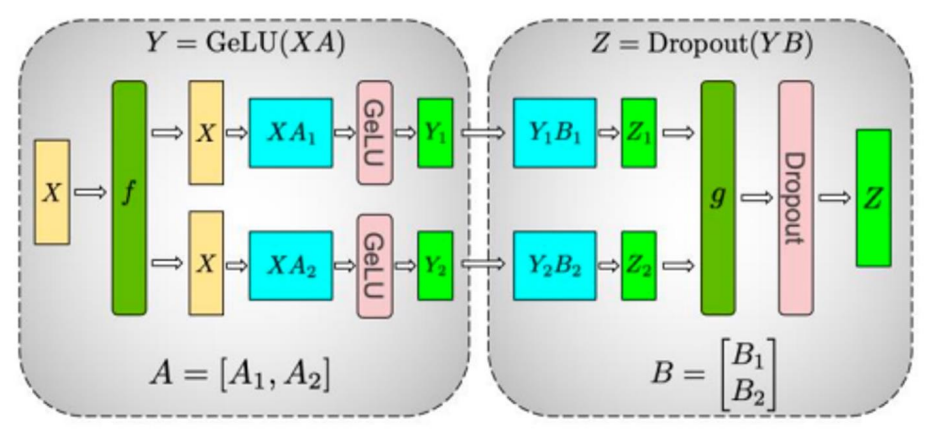

### **[超详详解] 零气泡流水线并行 (Zero-Bubble Pipeline Parallelism)**

#### **1. 问题重访：为何“流水线气泡”如此致命？**

为了理解“零气泡”技术的革命性,我们必须首先深刻认识到标准流水线并行(即使是优化的1F1B调度)中“气泡”的危害。它不仅仅是“一点点”的资源浪费。

在一个包含 `P` 个阶段(即 `P` 个GPU)的流水线中,处理完所有微批次所产生的总气泡时间是 `(P - 1) * T_step`,其中 `T_step` 是处理一个微批次在一个阶段上所需的时间(前向+反向)。

这意味着：

1.  **利用率天花板**：GPU的理论利用率上限约为 `M / (M + P - 1)`,其中 `M` 是微批次的数量。要达到90%的利用率,微批次数 `M` 至少需要是流水线阶段数 `P` 的9倍。这在实践中要求极大的全局批次。
2.  **批次大小的“绑架”**：为了维持高效率,我们被迫采用极大的**全局批次大小 (Global Batch Size)**。这不仅可能超出模型训练的最佳批次范围(影响收敛),更可能因为激活内存的累积而直接导致显存溢出(OOM)。

因此,流水线气泡是限制流水线并行效率和适用性的核心障碍。**“零气泡”技术的目标,就是从调度层面彻底消除这个 `(P - 1)` 的固定开销。**

#### **2. 核心洞察：反向传播并非“铁板一块”**

“零气泡”技术的“灵光一现”时刻,源于对反向传播计算依赖关系的深刻洞察。在标准的自动微分(Autograd)引擎看来,一个层的`backward`是一个不可分割的原子操作。但实际上,它包含两个计算性质和依赖关系截然不同的任务。

为了更直观地理解这一点,我们可以参考一个简单的多层感知机(MLP)的计算图。

> 一个简单的MLP计算图

上图清晰地展示了前向传播(Forward)和反向传播(Backward)的数据流。
*   **前向传播 (F)**: 输入 `x` 经过权重矩阵 `W` 的线性变换得到 `z`,再通过激活函数 $\sigma$ 得到输出 `y`。
*   **反向传播**: 从下游接收到对输出 `y` 的梯度 $\nabla_y L$ 后,反向传播开始。
    1.  **计算对输入的梯度 (`Backward for Data`, B)**: 首先,梯度需要穿过激活函数 $\sigma$,计算出对 `z` 的梯度 $\nabla_z L$。接着,为了将梯度继续向上传播给上一层,需要计算对输入 `x` 的梯度,即 $\nabla_x L = W^T \nabla_z L$。**这一步的结果是上一层反向传播的输入,因此必须立即执行。**
    2.  **计算对权重的梯度 (`Backward for Weights`, W)**: 同时,我们可以利用前向传播保存的输入 `x` 和已经计算出的 $\nabla_z L$ 来计算对权重 `W` 的梯度,即 $\nabla_W L = \nabla_z L x^T$。

从这个图中我们可以清晰地看到,计算 $\nabla_x L$ (B) 和计算 $\nabla_W L$ (W) 是两个并行的分支。计算 $\nabla_W L$ 的结果**仅用于最终的参数更新,而不会影响到梯度在网络层之间的反向传播**。

这证实了我们的核心洞察：

1.  **计算对输入的梯度 (`Backward for Data`, 记为 B)**
    *   **任务**: 计算损失 $L$ 对该层**输入激活值** $X_{i-1}$ 的偏导数 $\frac{\partial L}{\partial X_{i-1}}$。
    *   **依赖关系**: 这是**流水线的生命线**。它的计算结果是上一层(上游GPU)执行反向传播所必需的输入。因此,它位于**关键路径 (Critical Path)** 上,具有**强串行依赖性**。

2.  **计算对权重的梯度 (`Backward for Weights`, 记为 W)**
    *   **任务**: 计算损失 $L$ 对该层**模型权重** $W_i$ 的偏导数 $\frac{\partial L}{\partial W_i}$。
    *   **依赖关系**: **最关键的洞察在于**：一旦计算出 $\frac{\partial L}{\partial W_i}$,这个结果在当前训练迭代步中,除了在**最后**被优化器用于更新参数外,**没有任何其他计算依赖它**。它是一个**依赖图中的“终端节点”**。
    *   这意味着,`W` 的计算**脱离了关键路径**。它是一个可以被**推迟 (defer)** 和**重新调度 (reschedule)** 的任务。

**革命性的调度思想由此诞生**：我们可以将 `B` 和 `W` 的计算**解耦 (decouple)**。我们只在维持流水线运转所必需的时刻执行 `F` (前向) 和 `B` (对输入的反向),而将计算量同样可观的 `W` (对权重的反向) 视为可以灵活调度的“填充块”,用它来填满原本由于等待而产生的气泡。

#### **3. 调度策略对比：从 1F1B 到零气泡 (ZB)**

##### **3.1 标准 1F1B 调度**

> 1F1B 流水线调度示意图

在 1F1B 调度中,`Forward` (前向) 和 `Backward` (反向,作为一个整体) 交错执行。可以看到,在启动和结束阶段,大量的白色方块代表了设备空闲,形成了巨大的“气泡”。

##### **3.2 零气泡 (ZB) 调度详解**

> 手工设计的零气泡流水线调度 (ZB-H1/H2)

上图展示了经过精心设计的 ZB 调度。图中 `F` 代表前向,`B` 代表对输入的反向(关键路径),`W` 代表对权重的反向(可延迟任务)。让我们一步步解析它是如何“吃掉”气泡的：

1.  **启动阶段 (Ramp-up)**：
    *   在 1F1B 中,当 GPU 1 执行完第一个微批次的 `F_1,0` 后,它会空闲下来,等待 GPU 0 完成 `F_0,1` 并传来激活。
    *   在 ZB 调度中,当 GPU 1 完成 `F_1,0` 后,它不会空闲。调度器会检查是否有**已就绪的 `W` 任务**。例如,当梯度从下游传回,使得第一个微批次的 `B_1,0` 计算完成后,调度器并**不立即**计算 `W_1,0`,而是优先处理关键路径上的下一个 `F` 或 `B` 任务。`W_1,0` 作为一个可执行的任务被放入队列。现在,在等待 `F_0,1` 激活的这个空闲时间片,GPU 1 就可以从队列中取出 `W_1,0` 并执行它。
2.  **稳定阶段 (Steady State)**：
    *   设备的每个时间片都被 `F`, `B`, `W` 之一的计算任务填满。调度器会优先保证关键路径 `F` 和 `B` 的流畅执行,然后在任何空闲的间隙插入 `W` 的计算。整个流程像一个被精密编排的交响乐,没有任何停顿。
3.  **结束阶段 (Ramp-down)**：
    *   当最后一个微批次的前向传播完成后,流水线开始排空。
    *   在 1F1B 中,先完成任务的 GPU(如 GPU 0)会进入长时间的等待。
    *   在 ZB 调度中,这些 GPU 正好利用这段时间,集中处理所有**在前面阶段被推迟的 `W` 计算任务**。它们有一个积压的 `W` 任务队列需要清空。
    *   **结果**：所有设备几乎同时完成所有工作,同步进行最后的参数更新,然后一起进入下一个训练步。气泡被彻底消除。

#### **4. “天下没有免费的午餐”：代价与挑战**

虽然“零气泡”在计算效率上近乎完美,但它是在牺牲其他资源的基础上实现的：

1.  **内存压力激增 (The Biggest Trade-off)**：
    *   **原因**: 在标准 1F1B 中,`W` 的计算紧随 `B` 之后,这意味着计算 `W` 所需的前向激活值可以很快被使用并释放。但在 ZB 调度中,`W` 的计算被**显著推迟**了。
    *   **后果**: 为了在未来的某个时间点能计算 `W`,GPU 必须在显存中**更长时间地保留**相应微批次的**前向激活值**。这导致峰值激活内存显著增加,甚至可能抵消掉流水线并行本身带来的内存节省优势。这是一种典型的“**用内存换取计算效率**”的权衡。
2.  **极致的系统复杂性 (Engineering Nightmare)**：
    *   **实现难度**: 要实现 `F`, `B`, `W` 的计算分离和自定义调度,不能依赖标准的 Autograd 引擎。开发者需要：
        *   **深度侵入框架**：手动构建计算图,拦截并重构反向传播过程。
        *   **自定义调度器**: 设计一个复杂的调度器来管理每个设备上的 `F`, `B`, `W` 任务队列,并精确处理它们之间的依赖关系。
        *   **手动内存管理**: 精细地控制何时分配和释放激活值,以避免内存溢出。
    *   **维护成本**: 正如课堂轶事所揭示的,这种系统极其复杂,难以调试和维护,通常只有少数顶尖的系统专家能够驾驭,成为团队中不可或缺的“承重之人”。

#### **5. 总结**

零气泡流水线并行是并行化策略中追求极致硬件利用率的典范。它通过对计算图依赖关系的深刻理解,将原本串行的流程分解为“关键路径”和“可延迟任务”,并通过精巧的调度将后者用于填充等待间隙。

*   **核心思想**: 解耦 `B` (关键路径) 和 `W` (可延迟) 的计算。
*   **主要收益**: 接近 100% 的 GPU 利用率,消除了传统流水线的气泡开销。
*   **主要代价**: 显著增加的峰值激活内存和极高的系统实现与维护复杂度。

它是像 DeepSeek (`dual-pipe` 实现) 这类前沿团队在现有硬件上榨取每一滴性能的“核武器”,但对于绝大多数应用场景而言,其复杂性可能超过了其带来的收益。